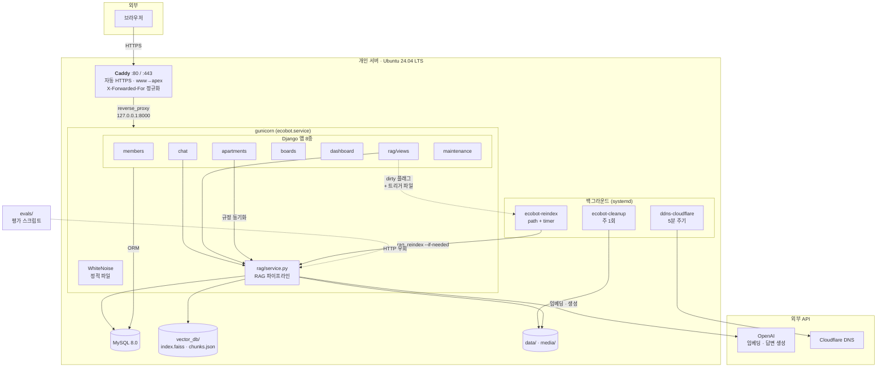
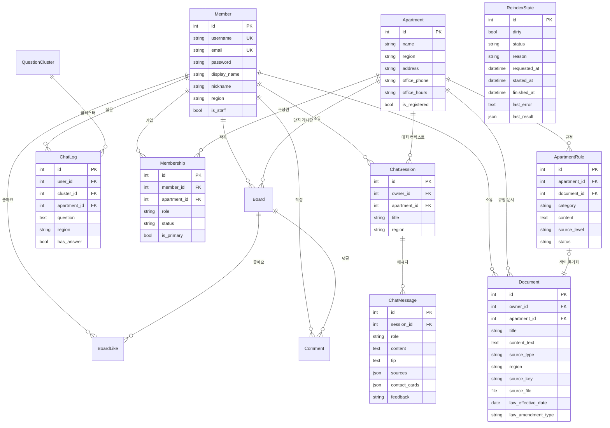
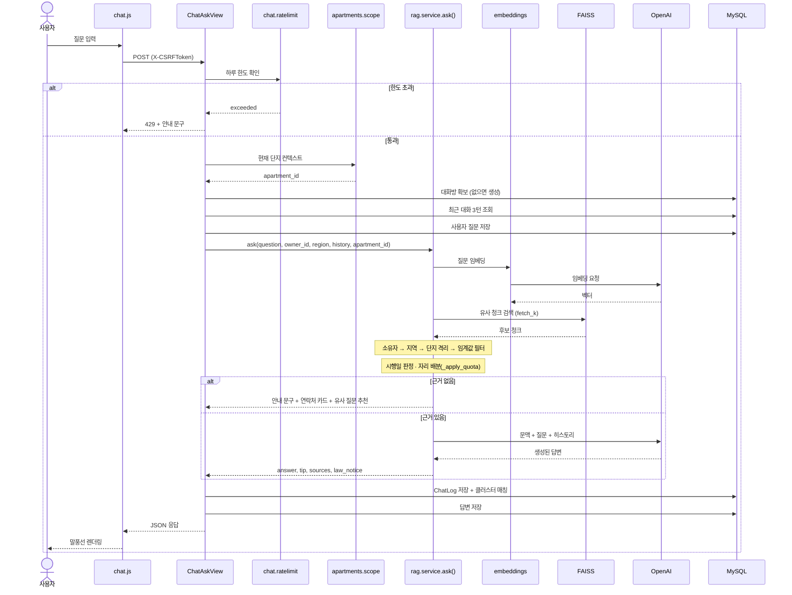
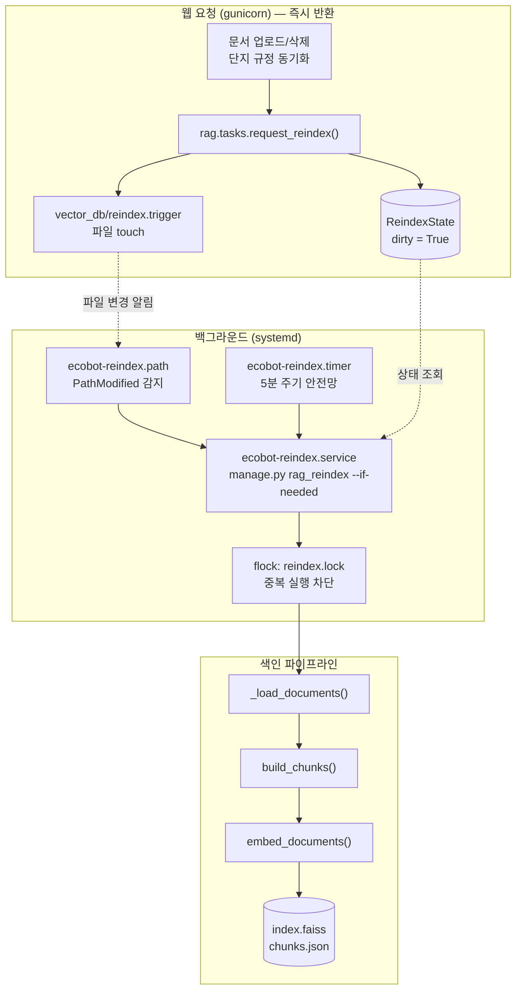
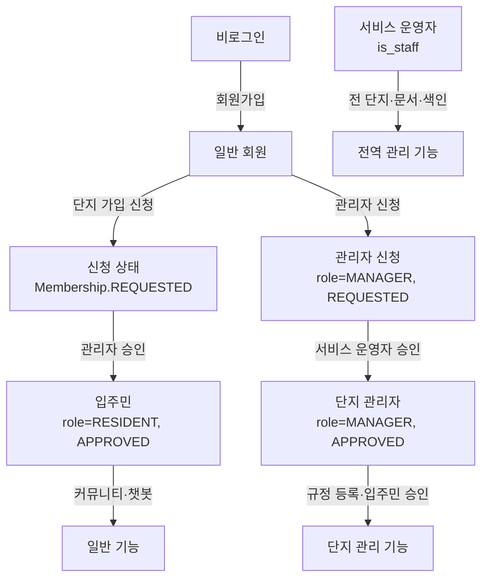
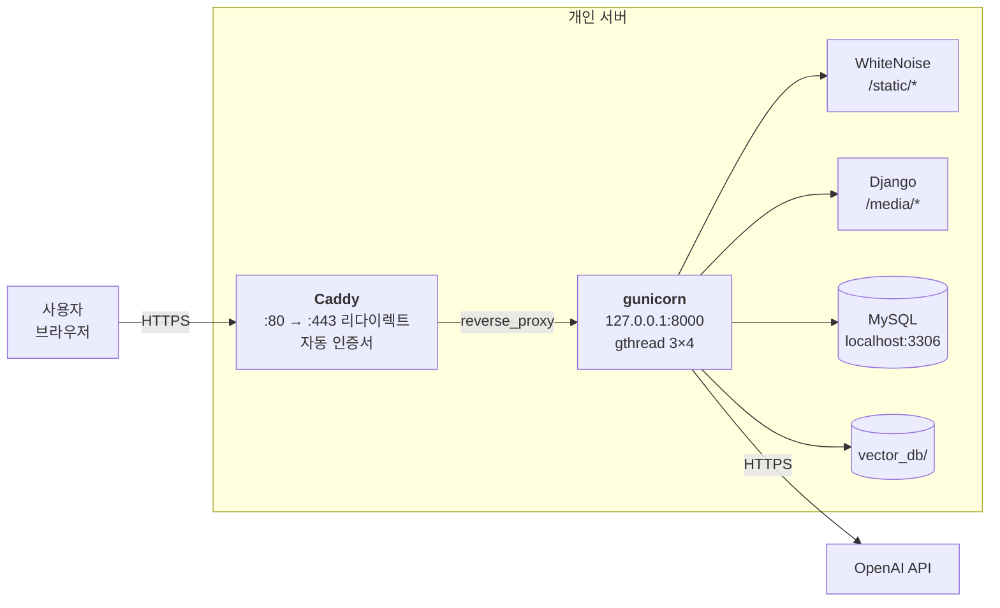

# EcoBot 시스템 아키텍처 및 상세 설명 문서

**SKN32 4차 프로젝트 · 3팀**
3차(FastAPI) Ecobot을 Django로 이식하고, 아파트 단지 관리·커뮤니티 기능을 확장하여 `ecobotapt.com`에 배포한 시스템의 구성도입니다.

> **기준 브랜치**: `deploy-ecobotapt` (운영 배포본)
> `main`에는 배포 구성(9장)과 재색인 비동기화(5-2)가 아직 반영되어 있지 않습니다.

---

## 1. 개요

EcoBot은 지역별 분리배출 가이드와 환경 법령을 근거로 답변하는 RAG(Retrieval-Augmented Generation) 기반 챗봇 서비스입니다. 4차에서는 여기에 **아파트 단지 단위의 규정 관리와 주민 커뮤니티**를 얹어, 전국 공통 → 지자체 → 우리 단지의 3계층 근거를 한 답변에서 함께 제시합니다.

### 1-1. 서비스 주소

| 구분 | 값 |
|---|---|
| 서비스 URL | `https://ecobotapt.com` |
| www 처리 | `www.ecobotapt.com` → apex로 301 리다이렉트 |
| 프로토콜 | HTTPS (Let's Encrypt, Caddy 자동 발급·갱신) |

### 1-2. 기술 스택

| 구분 | 채택 기술 | 비고 |
|---|---|---|
| 웹 프레임워크 | Django 5.x (MTV) | 3차 FastAPI + React SPA를 단일 서버로 통합 |
| WSGI 서버 | gunicorn (gthread, 3 workers × 4 threads) | 요청 대부분이 외부 API 대기라 스레드형 선택 |
| 리버스 프록시 | Caddy 2 | 자동 HTTPS, HTTP→HTTPS 리다이렉트 |
| 정적 파일 | WhiteNoise (압축 + 파일명 해싱) | Django 프로세스가 직접 서빙 |
| 데이터베이스 | MySQL 8.0 (운영) / SQLite (개발) | `DB_ENGINE` 환경변수로 전환 |
| 벡터 검색 | FAISS (`IndexFlatIP` + L2 정규화) | 3차 그대로 유지 |
| 임베딩 | OpenAI `text-embedding-3-small` (1536차원) | hash / local / gemini 백엔드 선택 가능 |
| 답변 생성 LLM | OpenAI `gpt-4o-mini` | gemini 백엔드 선택 가능 |
| 프론트엔드 | Django 템플릿 + Vanilla JS | 3차 React·TypeScript·Vite 제거 |
| 인증 | Django 세션 + PBKDF2 | 3차 JWT + passlib 대체 |
| 프로세스 관리 | systemd (유닛 7종) | 앱 · 재색인 · 정리 · DDNS |

### 1-3. 지원 지역 (11종)

전국 공통(`common`)과 서울·천안·부산 남구·인천 미추홀구·세종·제주·대구·대전·수원·울산 10개 지자체입니다. 지역 코드는 `members/models.py`의 `REGION_CHOICES`가 단일 출처이며, RAG의 지역 필터와 문서 파일명 파싱(`REGION_FILENAME_KEYWORDS`)이 같은 값을 참조합니다.

### 1-4. 3차와의 관계

RAG 파이프라인의 **기술 선택은 전부 계승**했습니다. 조문 단위 청킹, 별표 독립 분리, 임베딩 디스크 캐시, FAISS 코사인 유사도, 자리 배분(`_apply_quota`), 임계값 기반 환각 방지가 그대로 살아 있습니다. 이를 가능하게 하려고 `config/settings.py`가 3차 `Settings` 클래스의 속성명(`RAG_TOP_K`, `EMBEDDING_BACKEND`, `INDEX_DIR` 등)을 변경 없이 유지합니다.

바뀐 것은 이 파이프라인을 감싸는 **웹 계층·데이터 계층·운영 계층**입니다.

---

## 2. 전체 구조 및 아키텍처

브라우저 → Caddy → gunicorn(Django 8개 앱) → 저장소(MySQL · FAISS · 파일) → 외부 LLM API 구조입니다. 재색인은 웹 요청 경로에서 분리되어 별도 systemd 서비스가 처리하고, 평가 스크립트는 HTTP 계층을 거치지 않고 `rag.service`를 직접 호출합니다.



### 설계상의 핵심 결정

**gunicorn은 루프백에만 바인딩합니다.** `bind = "127.0.0.1:8000"`이라 외부에서 직접 접근할 수 없고 반드시 Caddy를 거칩니다. `0.0.0.0`으로 열면 프록시를 우회한 평문 접속이 가능해지고, 그 요청은 `X-Forwarded-Proto`가 없어 CSRF·쿠키 동작이 달라집니다.

**RAG 서비스는 HTTP를 모릅니다.** `rag/service.py`는 `request` 객체를 받지 않고 순수한 파라미터(`question`, `owner_id`, `region`, `apartment_id`, `history`)만 받습니다. 덕분에 평가 스크립트와 관리 명령이 웹 서버 없이 같은 코드 경로를 실행할 수 있고, 3차에서 측정한 지표를 4차에서 동일 조건으로 재현할 수 있습니다.

**무거운 작업은 요청 밖으로 뺐습니다.** 문서 업로드·삭제 요청은 재색인을 예약만 하고 즉시 반환합니다. 실제 임베딩은 별도 프로세스가 수행합니다(5-2 참고).

**단방향 의존성.** `rag`가 `apartments`를 참조하고 그 역은 없습니다. `rag/models.py`의 `Apartment` FK는 문자열 참조(`"apartments.Apartment"`)로 두어 순환 import를 차단합니다.

---

## 3. 계층별 상세 설명

### 3-1. 프로젝트 설정 계층 (`config/`)

| 파일 | 역할 |
|---|---|
| `settings.py` | 앱 등록, DB 분기, 인증, **RAG 설정 블록**, **운영 보안 블록**, 로깅 |
| `urls.py` | 최상위 라우팅 + 운영 환경 미디어 서빙 |
| `wsgi.py` | WSGI 진입점 (gunicorn이 `config.wsgi:application`으로 로드) |

### 3-2. 애플리케이션 계층 (8개 앱)

| 앱 | 책임 | 주요 모델 | 라우트 수 |
|---|---|---|---|
| `members` | 회원가입·로그인·프로필·탈퇴, 가이드 페이지 | `Member` | 8 |
| `chat` | 대화방, 대화 기록, 질문 클러스터, 피드백, **하루 한도** | `ChatSession` `ChatMessage` `ChatLog` | 6 |
| `rag` | 문서 관리, 청킹·임베딩·벡터검색·답변 생성, **재색인 예약** | `Document` `QuestionCluster` `ReindexState` | 7 |
| `apartments` | 단지 검색·가입, 관리자 승인, 규정 관리 | `Apartment` `Membership` `ApartmentRule` | 16 |
| `boards` | 게시판 CRUD, 댓글, 좋아요, 관리자 비공개 | `Board` `Comment` `BoardLike` | 9 |
| `dashboard` | 관리자 통계 API | — (모델 없음) | 7 |
| **`maintenance`** | **업로드 파일 수명 관리 (고아 파일 방지)** | — (모델·마이그레이션 없음) | 0 |
| `config` | 랜딩·가이드·서비스 소개 | — | 4 |

앱 등록 순서에 제약이 하나 있습니다. `rag`와 `chat`이 `apartments.Apartment`를 문자열로 참조하므로 마이그레이션 순서상 `apartments`가 먼저 와야 합니다.

`maintenance`는 모델이 없는 시그널 전용 앱입니다. `pre_save`·`post_delete` 시그널로 `FileField`가 가리키던 실제 파일을 함께 지워, 레코드는 사라졌는데 디스크에만 남는 고아 파일을 막습니다. 다른 레코드가 같은 파일을 참조하고 있으면 삭제하지 않습니다.

### 3-3. RAG 파이프라인 모듈 (`rag/`)

3차 `app/services/`의 모듈을 옮긴 것으로, 4개 모듈은 **본문 수정 없이 import 문만 치환**했습니다.

| 모듈 | 역할 | 3차 원본 |
|---|---|---|
| `chunking.py` | 법령은 조문(`제N조`) 단위, 가이드는 품목(`[항목]`) 단위 분할. 별표·부칙 독립 분리 | `chunk_service.py` |
| `embeddings.py` | 4종 백엔드 추상화, 배치 처리, 디스크 캐시 | `embedding_service.py` |
| `vector_store.py` | FAISS 인덱스 구축·검색, `chunks.json` 메타 관리 | `vector_store_service.py` |
| `llm.py` | 프롬프트 조립, 섹션 파싱, 대화 히스토리 포맷 | `gemini_service.py` |
| `service.py` | 위 4개를 오케스트레이션. 검색·필터·자리배분·답변생성 | `rag_service.py` |
| `law_text.py` | 법령 원문 전처리 | `scripts/law_text.py` |
| **`tasks.py`** | **재색인 예약 계층 (신규)** | — |

`service.py`만 재작성했으며, "그대로 유지" 대상 8개 함수는 AST 수준 비교로 3차와 본문이 동일함을 확인했습니다.

**FAISS 한글 경로 대응**: `vector_store.py`는 `write_index()`/`read_index()` 대신 메모리 버퍼(`serialize_index`/`deserialize_index`)를 사용합니다. Windows 한글 경로에서 "Illegal byte sequence" 오류가 발생하던 문제를 수정한 것입니다.

### 3-4. 관리 명령 및 평가 도구

| 경로 | 역할 |
|---|---|
| `rag/management/commands/seed_docs.py` | `data/` 폴더 → `Document` 테이블 적재. `source_key` 기반 멱등 upsert, 삭제 파일 동기화, `--reindex` 옵션 |
| `rag/management/commands/rag_reindex.py` | 인덱스 재구축. `--if-needed`는 백그라운드 워커 전용. **flock으로 중복 실행 방지** |
| `rag/management/commands/measure_threshold.py` | 임베딩 백엔드별 유사도 분포 측정 → `RAG_MIN_SCORE` 산정 |
| `maintenance/management/commands/cleanup_orphan_files.py` | 참조 없는 업로드 파일 일괄 정리 |
| `apartments/management/commands/seed_apartments.py` | 단지 초기 데이터 적재 |
| `evals/run_eval_hybrid.py` | LLM + 규칙 혼합 평가. 통과율·환각률 측정 |
| `evals/run_report.py` | 평가 결과 리포트 생성 |
| `verify_boards.py` | boards 앱 end-to-end 검증 |

`rag_reindex`가 flock을 쓰는 이유는 path 유닛(파일 변경)과 timer(5분 주기)가 같은 서비스를 겹쳐 깨울 수 있고 관리자가 손으로 돌릴 수도 있기 때문입니다. 두 프로세스가 동시에 임베딩하면 API 비용이 두 배로 나가고 인덱스 파일을 서로 덮어씁니다. DB 플래그로 락을 흉내 내지 않은 이유는 프로세스가 죽었을 때 `status=running`이 영구히 남아 이후 실행이 전부 막히기 때문이며, flock은 프로세스가 사라지면 커널이 자동으로 해제합니다.

### 3-5. 프레젠테이션 계층

템플릿 30개(`base.html`·`_nav.html` 포함), 정적 자산 3개입니다.

| 파일 | 규모 | 비고 |
|---|---|---|
| `static/css/style.css` | 2,307줄 | 3차 1,475줄 + 4차 추가분 |
| `static/js/chat.js` | 440줄+ | 3차 `app.js` 이식. `localId`/`serverId` 이원화, `X-CSRFToken`, `escapeHtml` XSS 수정, **한도 초과 안내** |
| `static/js/dashboard.js` | 405줄 | 통계 로딩, 문서 업로드·삭제, 인덱스 재빌드 |

운영에서는 `collectstatic`이 이 파일들을 `staticfiles/`로 모으고, WhiteNoise가 압축본과 해시 파일명(`style.a1b2c3.css`)을 함께 만들어 서빙합니다.

### 3-6. 데이터 저장소

| 저장소 | 경로 | 내용 |
|---|---|---|
| RDB | MySQL `ecora` / `db.sqlite3` | 회원·문서·대화·단지·게시판·재색인 상태 |
| 벡터 인덱스 | `vector_db/` | `index.faiss`, `chunks.json`, 임베딩 캐시, `reindex.trigger`, `reindex.lock` |
| 원본 법령 | `data/laws/` | 12건 |
| 배출 가이드 | `data/guide/` | 21건 |
| 업로드 파일 | `media/documents/%Y/%m/` | 사용자·관리자 업로드 원본 |
| 정적 파일 | `staticfiles/` | `collectstatic` 산출물 (운영 전용) |

---

## 4. 데이터베이스 스키마

### 4-1. ERD



`ReindexState`는 다른 테이블과 FK로 연결되지 않은 **단일 행 테이블(pk=1 고정)** 입니다. 웹 요청과 백그라운드 워커 사이의 유일한 약속이라 독립적으로 존재합니다.

### 4-2. 주요 테이블 역할

| 테이블 | 역할 |
|---|---|
| `members_member` | `AbstractUser` 확장. 3차 `users` 대비 `region`, `nickname`, `photo` 등 프로필 필드 추가 |
| `rag_document` | 색인 대상 문서 1건. `content_text`가 **색인되는 유일한 본문** |
| `rag_questioncluster` | 임베딩 클러스터링으로 묶인 질문 그룹. 인기 질문 집계의 원천 |
| `reindex_state` | 재색인 대기·진행·실패 상태. 단일 행 |
| `chat_chatsession` | 대화방. 3차의 `session_id` 문자열을 FK로 승격 |
| `chat_chatmessage` | 대화 원문. 화면 복원 + 다음 질문의 맥락 |
| `chat_chatlog` | 통계 전용 로그. `has_answer`가 '자료없음 대응률' 지표의 원천 |
| `apartments_membership` | 회원-단지 연결. `role`(입주민/관리자) × `status`(신청/승인/거절) 2축 |
| `apartments_apartmentrule` | 단지 규정. 승인 시 `Document`로 동기화되어 RAG 근거에 편입 |

### 4-3. 재색인 상태 전이

```
idle ──request_reindex()──▶ dirty=True
dirty ──워커 시작──▶ RUNNING ──성공──▶ IDLE (dirty=False)
                            └─실패──▶ FAILED (dirty 유지 → 다음 실행이 재시도)
```

### 4-4. 3차 대비 스키마 변경

**추가된 테이블**: `ChatSession`, `Apartment`, `Membership`, `ApartmentRule`, `Board`, `Comment`, `BoardLike`, `ReindexState`

**`Document`에서 제거한 필드**

| 필드 | 제거 근거 |
|---|---|
| `content` | 에디터 JSON 원본. 법령·가이드에서는 `content_text`와 순수 중복(261KB 이중 저장), 사용자 문서에서는 직렬화된 JSON이 색인 본문에 섞여 들어가는 결함 |
| `summary` | LLM 생성 문장이 색인 본문에 이어 붙어, 모델 출력이 다음 답변의 '근거'로 승격되는 경로가 생김 |
| `parent_id` | 문서 계층은 RAG와 무관한 내비게이션 기능 |

**`Document`에 추가한 필드**: `source_file`, `source_key`, `apartment`, `law_effective_date`, `law_amendment_type`

**`LongText` 트릭 소멸**: 3차는 MySQL `TEXT`의 65,535바이트 한계 때문에 `Text().with_variant(LONGTEXT, "mysql")`이 필요했습니다. Django의 `TextField`는 MySQL 백엔드에서 이미 `LONGTEXT`로 생성되므로 이 문제가 자동 해결됩니다.

---

## 5. 요청 처리 흐름

### 5-1. 챗봇 질의응답 (`POST /chat/ask/`)



**환각 방지 2단 장치**가 이 흐름의 핵심입니다.

1. **임계값 필터** — 유사도가 `RAG_MIN_SCORE` 미만이면 근거로 삼지 않습니다. 근거가 하나도 없으면 **LLM을 호출하지 않고** 안내 문구를 반환합니다.
2. **시행일 판정** — 아직 시행되지 않은 법령은 답변 근거에서 제외하되 버리지 않고 "곧 이렇게 바뀝니다" 안내로 전환합니다. `is_currently_effective()`가 매번 오늘 날짜와 비교하므로 시행일이 지나면 별도 배치 없이 자동으로 근거에 포함됩니다.

**자리 배분(`_apply_quota`)**: 법령은 조문 수가 많아 청크 비중이 가이드를 압도합니다. 이를 보정하려 지역 전용 2 / 전국 공통 1 / 법령 2 자리를 각각 보장하고, 단지 규정은 결과가 실제로 있을 때만 조건부로 2자리를 배분합니다. 단지 결과가 없으면 기존 3분할과 완전히 동일하게 동작해 3차 지표가 보존됩니다.

**하루 한도(`CHAT_DAILY_LIMIT`, 기본 50건)**: 회원가입이 열려 있고 질문 1건마다 임베딩 + LLM 호출이 나가므로, 계정 하나로 API 비용을 무제한 소모하는 것을 막습니다. OpenAI 대시보드의 월 한도가 "터지기 직전에 서비스를 멈추는 차단기"라면 이쪽은 애초에 안 터지게 하는 장치입니다. 서비스 운영자(superuser)는 문서 검수 작업이 막히지 않도록 제외됩니다.

### 5-2. 색인 구축 흐름 — 요청과 분리

문서 업로드·삭제, 단지 규정 승인은 **재색인을 예약만 하고 즉시 반환**합니다.



**왜 이렇게 바꿨는가.** 이전에는 업로드 요청 안에서 `rebuild_index()`가 전체 문서를 다시 임베딩했습니다. 문서가 늘면 수십 초가 걸리는데 gunicorn 기본 타임아웃은 30초라, 넘기는 순간 워커가 죽어 업로드는 500으로 끝나고 색인은 중간 상태로 남습니다. 배포 시점에 `timeout=180`으로 버티고 있었지만 임시방편이었습니다.

**실패에 견디는 구조.** 트리거 파일 알림을 놓쳐도 5분 타이머가 `dirty`를 보고 같은 명령을 실행합니다. 재색인이 실패하면 `dirty`를 내리지 않으므로 다음 실행이 다시 시도합니다. 예약 자체가 실패해도 예외를 올리지 않습니다 — 문서 저장은 이미 끝났는데 색인 예약 때문에 사용자에게 500을 주는 것이 더 나쁘기 때문입니다.

**Celery를 쓰지 않은 이유.** 브로커(Redis)를 하나 더 띄워야 하고, 이 프로젝트에 비동기 작업은 이것 하나뿐입니다. systemd는 이미 쓰고 있고 로그도 journald로 모입니다. 작업 종류가 늘어나면 그때 옮기는 것이 맞습니다.

### 5-3. 문서 로딩 모드

`RAG_SOURCE` 설정에 따라 로딩 경로가 갈립니다.

| 모드 | 읽는 곳 |
|---|---|
| `db` (운영 기본값) | DB 전체 (law + guide + manual + apartment) |
| `files` | 폴더 (law + guide) + **DB (manual + apartment)** |

`files` 모드에서도 사용자 업로드와 단지 규정을 DB에서 읽는 이유는, 폴더만 읽으면 업로드 문서가 색인에서 빠지기 때문입니다. 3차의 관리자 업로드 버그(파일은 폴더에, 색인은 DB를 읽음)가 방향만 바뀌어 재발하는 구조로, 실제 실행 검증에서 확인 후 수정했습니다.

---

## 6. URL 엔드포인트 명세

전체 라우트 57개 + 운영 환경 미디어 서빙 1개입니다.

### 6-1. 화면 (Django 템플릿 렌더링)

| URL | 이름 | 접근 |
|---|---|---|
| `/` | `home` | 공개 |
| `/guide/<key>/` | `guide` | 공개 |
| `/service/` | `service` | 공개 |
| `/members/signup/` `/login/` | `members:signup` `members:login` | 공개 |
| `/members/mypage/` `/profile/` `/withdraw/` | `members:*` | 로그인 |
| `/chat/` | `chat:room` | 로그인 |
| `/boards/` `/boards/<pk>/` | `boards:list` `boards:detail` | 단지 소속 |
| `/rag/documents/` `/upload/` `/<pk>/` | `rag:*` | 로그인 |
| `/apartments/search/` `/join/` `/mine/` | `apartments:*` | 로그인 |
| `/apartments/manager-dashboard/` | `apartments:manager_dashboard` | 단지 관리자 |
| `/dashboard/` | `dashboard:index` | 서비스 운영자 |
| `/admin/` | Django admin | 서비스 운영자 |

### 6-2. AJAX 엔드포인트 (JSON)

| URL | 이름 | 3차 대응 |
|---|---|---|
| `POST /chat/ask/` | `chat:ask` | `POST /api/chat` |
| `GET /chat/sessions/` | `chat:sessions` | `GET /api/chat/sessions` |
| `POST /chat/sessions/<pk>/delete/` | `chat:session_delete` | *(신규)* |
| `GET /chat/popular/` | `chat:popular` | `GET /api/popular-questions` |
| `POST /chat/feedback/<pk>/` | `chat:feedback` | *(신규)* |
| `GET /rag/status/` | `rag:status` | `GET /api/rag/status` — **재색인 상태 포함** |
| `POST /rag/rebuild/` | `rag:rebuild` | `POST /api/rag/rebuild` — **예약만 하고 반환** |
| `POST /rag/search/` | `rag:search` | `POST /api/rag/search` |
| `GET /dashboard/stats/` | `dashboard:stats` | `GET /api/admin/stats` |
| `GET /dashboard/top-questions/` | `dashboard:top_questions` | `GET /api/admin/top-questions` |
| `GET /dashboard/region-stats/` | `dashboard:region_stats` | `GET /api/admin/region-stats` |
| `GET /dashboard/daily-trend/` | `dashboard:daily_trend` | `GET /api/admin/daily-trend` |
| `GET /dashboard/documents/` | `dashboard:documents` | `GET /api/admin/documents` |
| `GET /dashboard/feedback-stats/` | `dashboard:feedback_stats` | *(신규)* |

응답 JSON의 키와 형식은 3차와 동일하게 유지했습니다. 3차 `app.js`의 파싱 코드를 fetch 경로와 CSRF 헤더만 바꾸고 재사용하기 위해서입니다.

### 6-3. 미디어 파일 (운영 전용)

`django.conf.urls.static.static()`은 `DEBUG=False`이면 **빈 리스트를 반환**합니다. 그래서 개발용 블록만 두면 배포 직후 프로필 사진·게시글 첨부·단지 규정 파일이 전부 404가 됩니다. 운영에서는 `django.views.static.serve`를 명시적으로 연결합니다.

```
re_path(r"^media/(?P<path>.*)$", static_serve, {"document_root": MEDIA_ROOT})
```

`DJANGO_SERVE_MEDIA=False`로 끄고 `MEDIA_ROOT`를 홈 디렉터리 밖으로 옮기면 Caddy가 직접 서빙할 수 있습니다.

### 6-4. 3차에서 사라진 엔드포인트

| 3차 | 처리 |
|---|---|
| `POST /api/auth/register` `login` `logout` | Django Form POST + `django.contrib.auth` |
| `GET /api/me` | 템플릿에서 `request.user` 직접 참조 |
| `POST` `PUT /api/documents` | 업로드 화면으로 대체 (에디터 제거) |
| `GET /api/documents/tree` | 문서 계층 기능 제거 |
| `POST /api/documents/<id>/summary` | 미이식 |
| `POST /api/gemini/summarize` | 미이식 |
| `GET /api/health` | 미이식 |

---

## 7. 인증 및 권한 흐름

### 7-1. 인증 방식

Django 세션 인증을 사용합니다. 로그인 시 서버가 세션을 생성하고 `sessionid` 쿠키를 발급하며, 비밀번호는 PBKDF2로 해싱됩니다.

| 항목 | 3차 | 4차 |
|---|---|---|
| 방식 | JWT (`python-jose`) | 세션 (`django.contrib.sessions`) |
| 해싱 | passlib bcrypt | PBKDF2 (bcrypt 해셔 호환 유지) |
| 만료 | `ACCESS_TOKEN_EXPIRE_MINUTES=1440` | `SESSION_COOKIE_AGE = 86400` |
| CSRF | 불필요 (Bearer 토큰) | **`X-CSRFToken` 헤더 필수** |

3차 계정을 살릴 경우를 대비해 `PASSWORD_HASHERS`에 `BCryptSHA256PasswordHasher`를 함께 등록해 두었습니다.

### 7-2. 3계층 권한 모델



| 역할 | 판정 | 권한 |
|---|---|---|
| 일반 회원 | 로그인 | 챗봇, 문서 업로드, 단지 검색·가입 신청 |
| 입주민 | `Membership(RESIDENT, APPROVED)` | + 커뮤니티, 단지 규정 열람 |
| 단지 관리자 | `Membership(MANAGER, APPROVED)` | + 규정 등록, 입주민 승인, 게시판 관리 |
| 서비스 운영자 | `Member.is_service_admin` (= `is_staff`) | + 전 단지 관리, 문서·색인 관리, 통계, **하루 한도 면제** |

권한 판정은 `apartments/permissions.py` 한 곳에 모여 있습니다. `can_manage_apartment()`가 규정 승인과 입주민 승인 양쪽에서 공유되는데, "승인자가 이 단지를 실제로 아는 사람이어야 한다"는 조건이 둘 다 같기 때문입니다.

> **3차 대비 개선**: 3차는 `"admin" in user.email.lower()`로 관리자를 판정해 `badmin@example.com`을 관리자로 오인하고 `admin@`이 아닌 관리자를 놓쳤습니다. 4차는 `is_staff` 기반으로 교체했습니다.

### 7-3. 애플리케이션 보안

**단지 규정 격리 (fail-closed)**: 지역 필터는 `region=None`인 청크를 공통 문서로 관용 통과시키지만, 단지 규정은 그렇게 하면 안 됩니다. 옛 인덱스에 남은 단지 규정이 전체 사용자에게 노출되는 사고로 이어지기 때문입니다. `apartment_id`가 `None`이면 `apartment` 타입 청크를 **전부 제거**합니다.

**문서 소유자 필터**: 검색 결과에서 `owner_id == 요청자` 또는 `source_type ∈ (law, guide, apartment)`만 남깁니다. 남의 `manual` 문서 상세 조회는 404를 반환해 존재 여부 자체를 숨깁니다.

**자기신고 데이터의 권한 승격 차단**: 입주민은 항상 `source_level=resident` 등급으로만 규정을 제안할 수 있습니다. 자기신고 계정이 `official` 등급을 자칭하면 사실상 검토 없이 공식 규정으로 노출되는 우회가 생기기 때문입니다.

**XSS**: `chat.js`의 말풍선 렌더링에 `escapeHtml()`을 적용했습니다(3차 미적용분 수정).

### 7-4. 운영 보안 설정 (`DEBUG=False`일 때만)

개발 서버(`http://127.0.0.1`)에서 secure 쿠키를 켜면 로그인이 되지 않으므로 분기해 두었습니다.

| 설정 | 값 | 목적 |
|---|---|---|
| `SESSION_COOKIE_SECURE` `CSRF_COOKIE_SECURE` | `True` | 쿠키를 HTTPS 요청에만 전송 |
| `SESSION_COOKIE_HTTPONLY` | `True` | JS에서 세션 쿠키 읽기 차단 (XSS 피해 축소) |
| `SESSION_COOKIE_SAMESITE` `CSRF_COOKIE_SAMESITE` | `Lax` | 외부 사이트발 POST에 쿠키 미첨부 |
| `SECURE_CONTENT_TYPE_NOSNIFF` | `True` | 업로드 파일이 HTML로 해석되는 것 방지 |
| `X_FRAME_OPTIONS` | `DENY` | 클릭재킹 방지 |
| `SECURE_SSL_REDIRECT` | `False` (기본) | Caddy가 이미 처리. 중복 시 무한 리다이렉트 위험 |
| `SECURE_HSTS_SECONDS` | `0` (기본) | 되돌리기 어려워 인증서 안정 확인 후 활성화 |

**프록시 신뢰 설정**이 특히 중요합니다.

```python
if _env_bool("DJANGO_BEHIND_PROXY", "False"):
    SECURE_PROXY_SSL_HEADER = ("HTTP_X_FORWARDED_PROTO", "https")
```

Caddy는 `X-Forwarded-Proto`를 자동으로 붙입니다(nginx와 달리 별도 설정이 불필요). 이 헤더를 신뢰하도록 알려주지 않으면 Django는 모든 요청을 평문 http로 보고, 그 결과 secure 쿠키가 붙지 않으며 CSRF 검사가 `http://` origin을 기대해 로그인·글쓰기가 전부 403이 됩니다. 다만 **앞단 프록시가 반드시 존재할 때만** 켜야 합니다. 프록시 없이 켜면 클라이언트가 보낸 헤더를 그대로 믿게 되어 위조가 가능합니다.

`CSRF_TRUSTED_ORIGINS`는 명시하지 않으면 `ALLOWED_HOSTS`의 실제 도메인에서 `https://` 형태로 유도합니다. 도메인을 추가할 때 두 곳을 고치다 한 곳을 빠뜨리는 사고를 막기 위함입니다.

### 7-5. 로깅

Django 기본 로깅은 `DEBUG=False`이면 예외를 `ADMINS`에게 메일로만 보냅니다. `ADMINS`를 설정하지 않았으므로 그대로 두면 **500 에러가 아무 데도 남지 않습니다.** stdout으로 내보내 gunicorn → systemd → journald로 흘러가게 했습니다.

```
journalctl -u ecobot -f
```

---

## 8. 외부 LLM 및 임베딩 연동

### 8-1. 백엔드 스위치

| 설정 | 값 | 용도 |
|---|---|---|
| `EMBEDDING_BACKEND` | `openai` | **운영 기본값**. `text-embedding-3-small`, 1536차원 |
| | `gemini` | `gemini-embedding-001`, 768차원 |
| | `local` | `sentence-transformers`, 384차원. API 키 불필요 |
| | `hash` | 2-gram 해시. **실행 확인 전용** |
| `LLM_BACKEND` | `openai` | **운영 기본값**. `gpt-4o-mini` |
| | `gemini` | `gemini-2.5-flash` |

> **hash 백엔드 주의**: 표면 문자열 일치만 잡으므로 무관한 질문도 우연 일치로 임계값을 넘습니다. '자료없음 대응' 분기가 사실상 동작하지 않으니 **품질 지표 측정에 사용하면 안 됩니다.**

### 8-2. 운영 의존성 분리

`requirements-prod.txt`는 `requirements.txt`와 두 가지가 다릅니다.

**추가**: `gunicorn`, `whitenoise[brotli]`

**제거**: `sentence-transformers`, `langchain-*` 계열

`sentence-transformers`는 torch를 끌고 오는데 그것만 2~3GB입니다. 이 둘은 `EMBEDDING_BACKEND=local` 또는 `RAG_PIPELINE=langchain`일 때만 쓰이고, 두 경우 모두 **함수 안에서 지연 임포트**되므로 패키지가 없어도 앱은 정상 기동합니다.

> ⚠️ 운영 `.env`에서 위 두 값을 바꾸려면 해당 패키지를 다시 넣고 재설치해야 합니다. 그대로 두면 그 요청에서만 `ModuleNotFoundError`가 납니다(기동 시점에는 잡히지 않습니다).

### 8-3. 비용·안정성 대응

| 대응 | 구현 |
|---|---|
| 임베딩 디스크 캐시 | 텍스트+백엔드 해시를 키로 재사용. 재색인 시 API 호출 최소화 |
| 사용자별 하루 한도 | `CHAT_DAILY_LIMIT=50` (운영자 제외) |
| 재색인 중복 방지 | flock — 동시 실행 시 임베딩 비용 2배 방지 |
| 배치 처리 | `GEMINI_EMBEDDING_BATCH=100` |
| 재시도 대기 | `GEMINI_BATCH_DELAY=2.0`, `GEMINI_RETRY_WAIT=30` |
| 키 없음 폴백 | `[LLM 미연결]` 반환. 키 없이도 전체 흐름 실행 가능 |
| 쿼터 초과 감지 | `insufficient_quota` / `429` / `rate limit` 문자열을 잡아 사용자에게 안내 |
| 차원 불일치 검사 | `vector_store.search()` 내부에서 검출 후 안내 오류 |

### 8-4. 검색 파이프라인 이중화

`RAG_PIPELINE` 설정으로 legacy와 LangChain 경로를 전환합니다.

```
ask() → search() → _retrieve() ─┬─ legacy    : vector_store.search()
                                └─ langchain : similarity_search_with_score()
         ↓ 여기부터 완전 공유
      필터 → _apply_quota() → _build_context() → _generate_answer()
```

3차는 `rebuild_index()` / `search()` / `ask()` 3개 함수가 `*_langchain()` 버전으로 통째로 복제되어 있었고, 필터링·자리배분·답변생성이 양쪽에 중복되어 있었습니다. 4차는 경로가 갈리는 지점이 "질문 → 후보 청크 목록" 하나뿐임을 확인하고 `_retrieve()` 28줄로 분리했습니다.

운영 기본값을 `legacy`로 둔 이유는 3차 지표(통과율 93.3% · 환각률 6.7%)가 이 경로로 측정된 수치이기 때문입니다.

---

## 9. 배포 구성

### 9-1. 배포 환경

| 항목 | 값 |
|---|---|
| 호스팅 | 자체 운영 리눅스 서버 (온프레미스) |
| OS | Ubuntu 24.04.3 LTS |
| CPU / RAM | 8코어 / 60GB |
| 디스크 | 915GB NVMe |
| 데이터베이스 | MySQL 8.0.46 (동일 호스트, 로컬 바인딩) |
| 도메인 | `ecobotapt.com` (Cloudflare DNS) |
| 공인 IP | 가정용 회선 — DDNS로 추적 |
| 앱 경로 | `$APP_HOME` (앱 계정 홈 아래) |
| 실행 계정 | `$APP_USER` — 앱 전용. sudo 권한 없음 |
| 관리 계정 | `$ADMIN_USER` — sudo 보유. 인프라 작업 전용 |

> 이하 본문의 `$APP_USER` · `$ADMIN_USER` · `$APP_HOME`은 실제 계정명·경로를 대신하는 표기입니다. 실제 값은 저장소의 `deploy/` 설정 파일과 `docs/deploy.md`에 있습니다.

이 서버는 EcoBot 전용이 아니라 Next.js 위키·Ollama 등이 함께 동작합니다. gunicorn 워커를 3개로 제한한 것도 이 때문입니다.

### 9-2. 요청 경로



| 경로 | 처리 주체 | 비고 |
|---|---|---|
| `/static/*` | WhiteNoise (Django 프로세스 내부) | 압축 + 해시 파일명 |
| `/media/*` | Django `static_serve` | 경로 탈출 방어 포함 |
| 그 외 전부 | Django 뷰 | |

WhiteNoise를 쓴 이유는 Caddy가 `caddy` 사용자로 동작하는데 앱 계정의 홈 디렉터리가 `0750`이라 이를 통과하지 못하기 때문입니다. 권한을 푸는 대신 Django 프로세스가 직접 내보내는 쪽을 택했습니다.

### 9-3. Caddy 설정 (`deploy/Caddyfile.ecobotapt`)

```
www.ecobotapt.com {
    redir https://ecobotapt.com{uri} permanent
}

ecobotapt.com {
    reverse_proxy 127.0.0.1:8000 {
        header_up X-Forwarded-For {remote_host}
        transport http {
            response_header_timeout 180s
            read_timeout 180s
        }
    }
    request_body { max_size 100MB }
    encode zstd gzip
}
```

**www를 apex로 통일하는 이유**: 주소가 갈리면 세션 쿠키와 CSRF origin이 갈라집니다. www로 로그인한 뒤 apex로 이동하면 로그아웃된 것처럼 보입니다.

**`X-Forwarded-For`를 덮어쓰는 이유**: Caddy 기본 동작은 클라이언트가 보낸 값 **뒤에 덧붙이는** 것이라, 그대로 두면 `위조값, 실제주소` 순서가 되어 앞에서부터 읽는 코드가 위조값을 쓰게 됩니다. `{remote_host}`로 실제 주소를 덮어씁니다.

**타임아웃 180초를 양쪽에 맞추는 이유**: gunicorn의 `timeout=180`과 짝을 이룹니다. 한쪽만 짧으면 그쪽에서 먼저 끊겨 요청이 실패합니다.

### 9-4. gunicorn 설정 (`deploy/gunicorn.conf.py`)

| 설정 | 값 | 근거 |
|---|---|---|
| `bind` | `127.0.0.1:8000` | 프록시 우회 차단 |
| `worker_class` | `gthread` | 요청 대부분이 CPU가 아니라 **OpenAI 응답 대기**. 대기 중인 워커가 프로세스를 통째로 붙잡지 않도록 |
| `workers` × `threads` | 3 × 4 | 8코어이지만 Next.js·Ollama·MySQL이 함께 동작 |
| `timeout` | 180초 | 챗봇 질문 1건이 임베딩 + LLM 호출로 수 초~수십 초 |
| `graceful_timeout` | 30초 | |
| `keepalive` | 5초 | 앞단이 Caddy 하나뿐이라 안전 |
| `max_requests` / `jitter` | 1000 / 100 | FAISS를 요청마다 역직렬화해 메모리 파편화가 쌓임. jitter로 동시 재시작 방지 |
| `control_socket_disable` | `True` | `ProtectHome=read-only`와 충돌해 매 기동마다 무해한 오류가 발생, 진짜 오류를 가림 |
| `accesslog` / `errorlog` | `-` (stdout) | journald가 수집·로테이션 |

액세스 로그에 응답 시간(`%(D)s`, 마이크로초)을 포함시켜 느린 요청을 추적할 수 있게 했습니다.

### 9-5. systemd 유닛 7종

| 유닛 | 종류 | 역할 |
|---|---|---|
| `ecobot.service` | service | Django 애플리케이션 (gunicorn) |
| `ecobot-reindex.service` | service | `manage.py rag_reindex --if-needed` |
| `ecobot-reindex.path` | path | `vector_db/reindex.trigger` 변경 감지 |
| `ecobot-reindex.timer` | timer | 5분 주기 안전망 (부팅 3분 후 시작) |
| `ecobot-cleanup.service` | service | `manage.py cleanup_orphan_files` |
| `ecobot-cleanup.timer` | timer | 매주 일요일 04:00 (지연 최대 30분) |
| `ddns-cloudflare.service` + `.timer` | service + timer | 공인 IP 변경 시 Cloudflare DNS 레코드 갱신 (5분 주기) |

모든 타이머에 `Persistent=true`를 두어 서버가 꺼져 있던 동안 놓친 실행을 부팅 후 따라잡습니다. `RandomizedDelaySec`으로 여러 타이머가 동시에 깨어나는 것을 분산시킵니다.

### 9-6. 프로세스 격리 (`ecobot.service`)

```ini
[Service]
Type=notify
User=$APP_USER
Group=$APP_USER
After=network-online.target mysql.service

Restart=always
RestartSec=5
ExecReload=/bin/kill -s HUP $MAINPID

NoNewPrivileges=true
PrivateTmp=true
ProtectSystem=full
ProtectHome=read-only
ReadWritePaths=$APP_HOME/media
ReadWritePaths=$APP_HOME/vector_db
```

**최소 권한 원칙을 실제로 적용한 부분입니다.** `ProtectHome=read-only`로 홈 전체를 읽기 전용으로 만든 뒤, 실제로 써야 하는 두 디렉터리만 예외로 뚫었습니다. 애플리케이션이 뚫려도 시스템 전체로 번지지 않습니다.

`REINDEX_TRIGGER_FILE`을 `INDEX_DIR` 아래에 둔 것도 이 제약 때문입니다. 다른 곳에 두면 `ProtectHome=read-only`에 막힙니다.

`Type=notify` + `ExecReload`로 무중단 재시작이 가능합니다. 코드 배포 후 `systemctl reload ecobot`으로 워커만 교체합니다.

환경변수는 `EnvironmentFile`이 아니라 프로젝트의 `.env`에서 읽습니다. `config/settings.py`가 python-dotenv로 직접 로딩하므로, 유닛에도 적으면 두 곳이 어긋날 때 어느 쪽이 이겼는지 알기 어려워지기 때문입니다.

### 9-7. 설치 자동화 (`deploy/install-system.sh`)

root 권한이 필요한 작업만 모은 멱등 스크립트입니다. 몇 번을 실행해도 중복 추가하지 않습니다.

```bash
sudo bash deploy/install-system.sh deps      # 시스템 패키지
sudo bash deploy/install-system.sh db        # MySQL DB·계정 생성
sudo bash deploy/install-system.sh service   # systemd 유닛 설치
sudo bash deploy/install-system.sh caddy     # Caddyfile 병합·reload
sudo bash deploy/install-system.sh ddns      # Cloudflare DDNS
sudo bash deploy/install-system.sh all       # 전체
```

**계정 분리 문제를 스크립트로 해결한 사례입니다.** 저장소는 앱 계정 소유이고 그 홈 디렉터리가 `0750`이라, sudo 권한을 가진 관리 계정은 이 디렉터리를 통과조차 못 합니다. 따라서 아래 형태는 실패합니다.

```bash
sudo tee -a /etc/caddy/Caddyfile < deploy/Caddyfile.ecobotapt   # Permission denied
```

리다이렉트(`<`)는 sudo가 아니라 **셸**이 수행하므로, 관리 계정 권한으로 파일을 열려다 막히기 때문입니다. 스크립트는 전체가 root로 실행되므로 이 문제가 없습니다.

상세 절차는 **`docs/deploy.md` (배포 런북)** 를, 설계 판단 근거는 **`docs/decisions/0001-ecobotapt-배포-구성.md` (ADR 12건)** 을 참고하십시오.

### 9-8. 배포 관련 보안 조치

| 조치 | 내용 |
|---|---|
| HTTPS 강제 | Caddy 자동 인증서 + HTTP→HTTPS 리다이렉트 |
| 애플리케이션 비공개 | gunicorn이 루프백에만 바인딩 |
| DB 비공개 | MySQL을 `127.0.0.1`로 제한 |
| 프로세스 격리 | systemd `ProtectSystem` / `ProtectHome` / `NoNewPrivileges` |
| 권한 분리 | 앱은 `$APP_USER`, 인프라 작업은 `$ADMIN_USER`(sudo) |
| 비밀값 관리 | `.env` (git 미추적), DDNS 토큰 파일 `0600` |
| 업로드 상한 | Caddy `max_size 100MB` |

---

## 10. 3차 대비 아키텍처 변경 요약

| 영역 | 3차 | 4차 | 성격 |
|---|---|---|---|
| 웹 프레임워크 | FastAPI + uvicorn | Django + gunicorn | 전면 교체 |
| 프론트엔드 | React + TypeScript + Vite SPA | Django 템플릿 (단일 서버) | 전면 교체 |
| ORM | SQLAlchemy | Django ORM | 전면 교체 |
| 인증 | JWT + passlib | 세션 + PBKDF2 | 프레임워크 대체 |
| 스키마 검증 | Pydantic | Django Form | 프레임워크 대체 |
| RAG 파이프라인 | `app/services/` 5개 모듈 | `rag/` 7개 모듈 | **4개는 import만 치환** |
| LangChain 경로 | 함수 단위 복제 | `RAG_PIPELINE` 스위치 | 구조 개선 |
| 대화방 | `session_id` 문자열 | `ChatSession` FK | 정식화 |
| 권한 | 이메일 문자열 매칭 | `is_staff` + `Membership` | 결함 수정 |
| **재색인** | **요청 안에서 동기 수행** | **systemd 워커로 분리** | **구조 개선** |
| **실행 환경** | **로컬 `run.sh`** | **온프레미스 배포 (HTTPS)** | **신규** |
| **비용 통제** | **없음** | **하루 한도 + 캐시 + 락** | **신규** |
| 도메인 | 챗봇 단일 | + 단지 관리 + 커뮤니티 | 기능 확장 |

### 이식·운영 과정에서 수정한 결함

| 결함 | 원인 | 수정 |
|---|---|---|
| 관리자 업로드 색인 누락 | 파일 저장 후 DB 레코드 없이 `rebuild_index()` 호출 | 파일 → 레코드 → rebuild 순서로 변경 |
| files 모드 업로드 색인 누락 | `_load_documents()`가 폴더만 읽음 | manual·apartment 문서는 항상 DB에서 추가 로드 |
| Windows 한글 경로 FAISS 오류 | `write_index()`가 한글 경로 거부 | 메모리 버퍼 직렬화로 교체 |
| 업로드 시 워커 타임아웃 | 요청 안에서 전체 재임베딩 | 재색인을 systemd 워커로 분리 |
| 배포 후 정적 파일 404 | `DEBUG=False`에서 Django가 static 미서빙 | WhiteNoise 도입 |
| 배포 후 미디어 파일 404 | `static()`이 `DEBUG=False`에서 빈 리스트 반환 | `static_serve` 명시 연결 |
| 고아 업로드 파일 누적 | 레코드 삭제 시 파일이 디스크에 잔존 | `maintenance` 앱 시그널 + 주간 정리 |

---

## 11. 알려진 제약

| 항목 | 내용 | 영향 |
|---|---|---|
| 🔴 `manage.py rag_reindex` Windows 미지원 | `fcntl`을 모듈 최상단에서 임포트 | Windows 개발자는 이 명령만 실행 불가. `runserver`·`seed_docs`·웹 UI는 정상 |
| 🔴 자동 재색인은 Linux 전용 | systemd path/timer 유닛 기반 | Windows·macOS에서는 수동 실행 필요 |
| 🟡 FAISS 인덱스를 요청마다 역직렬화 | `vector_store.search()`에 인메모리 캐시 없음 | 응답 지연. 다만 워커 3개가 재시작 없이 새 인덱스를 즉시 반영하는 이점도 있음 |
| 🟡 `_migrate_clusters()` 미이식 | 3차 startup 훅. 대체 관리 명령 미작성 | 기존 대화 데이터를 살리지 않기로 해 실사용 영향 없음 |
| 🟡 HSTS 미적용 | `SECURE_HSTS_SECONDS=0` | 인증서 안정성 확인 후 활성화 예정 |
| 🟡 단일 인스턴스 | 이중화·로드밸런싱 없음 | 서버 장애 시 서비스 중단 |
| 🟡 가정용 회선 | 공인 IP 변동, 상향 대역폭 제한 | DDNS로 IP 변동은 대응 |

---

## 부록 A. 실행 구성

### 개발 (퀵스타트 — API 키·MySQL 불필요)

```bash
pip install -r requirements-quickstart.txt
copy .env.example .env    # DB_ENGINE=sqlite3, EMBEDDING_BACKEND=hash
python manage.py migrate
python manage.py createsuperuser
python manage.py seed_docs --reindex
python manage.py runserver
```

### 운영 (`ecobotapt.com`)

```env
DJANGO_DEBUG=False
DJANGO_ALLOWED_HOSTS=ecobotapt.com,www.ecobotapt.com,127.0.0.1
DJANGO_BEHIND_PROXY=True
DB_ENGINE=mysql
DB_NAME=ecora
RAG_SOURCE=db
EMBEDDING_BACKEND=openai
LLM_BACKEND=openai
RAG_PIPELINE=legacy
CHAT_DAILY_LIMIT=50
```

```bash
pip install -r requirements-prod.txt
python manage.py migrate
python manage.py collectstatic --noinput
sudo bash deploy/install-system.sh all
```

## 부록 B. 운영 확인 명령

```bash
systemctl status ecobot caddy mysql          # 서비스 상태
systemctl list-timers 'ecobot*' 'ddns*'      # 타이머 다음 실행 시각
journalctl -u ecobot -f                      # 애플리케이션 로그
journalctl -u ecobot-reindex -n 50           # 재색인 이력
systemctl reload ecobot                      # 무중단 재시작
```
