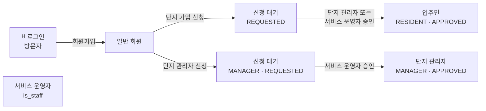
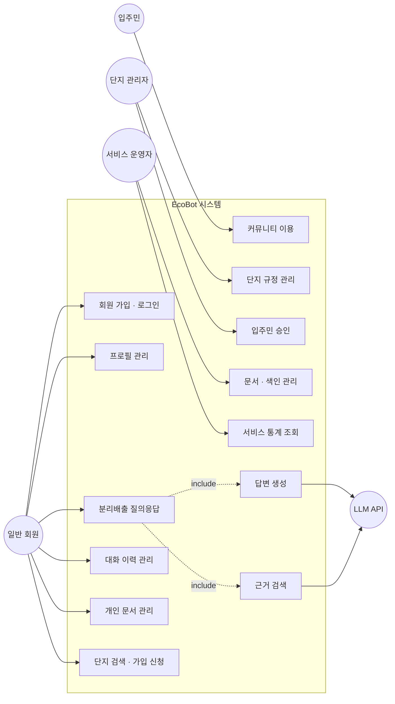
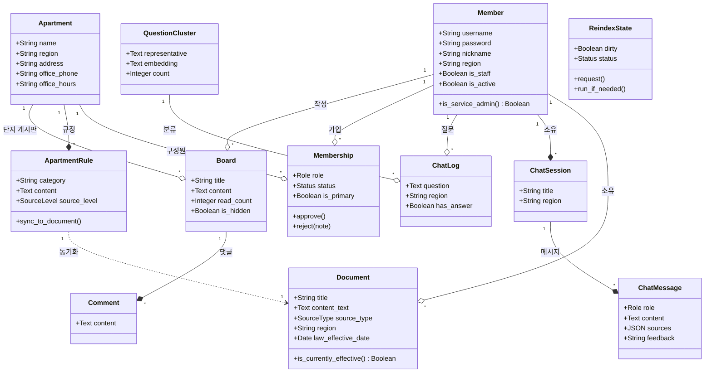
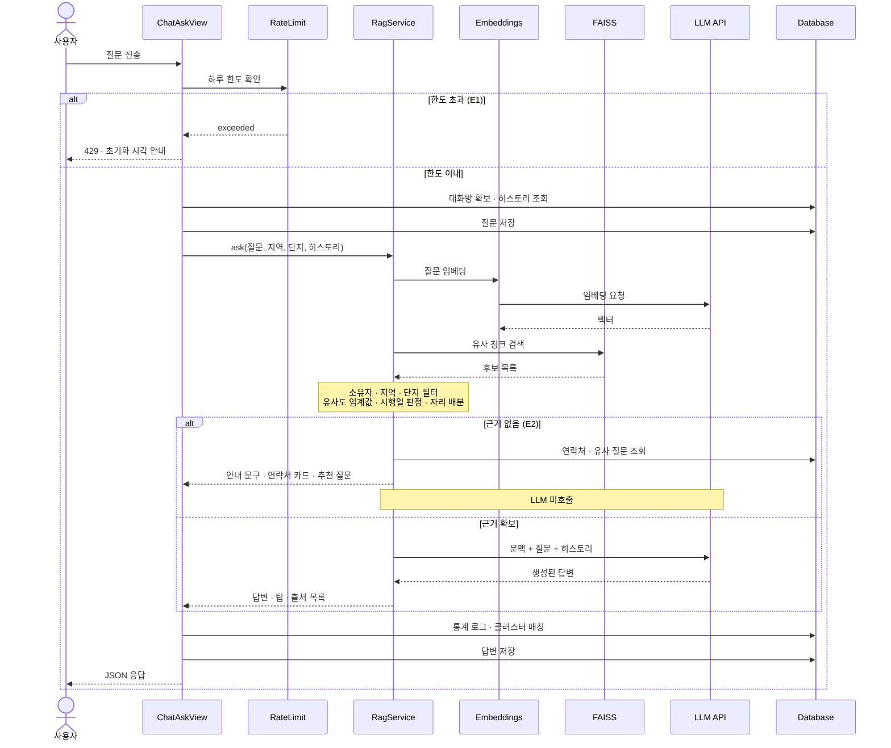
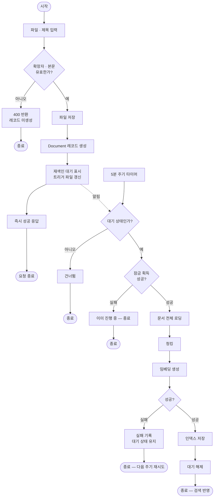

# EcoBot 요구사항 정의서

**아파트 분리배출 AI 챗봇 서비스**
*Requirements Definition Document*

SKN32 4차 프로젝트 · 3팀
교과목 4단위 프로젝트 — AI 활용 애플리케이션 개발

---

## 문서 버전 정보

| 버전 | 일자 | 변경 내용 |
|---|---|---|
| v1.0 | 2026-08-27 | 최초 작성. 3차(FastAPI) → 4차(Django) 전환 및 기능 확장 기준 요구사항 정의 |

---

## 목차

**1. 문서 개요**
　1.1 목적　1.2 문서 범위　1.3 관련 산출물　1.4 요구사항 작성 원칙

**2. 프로젝트 개요**
　2.1 배경 및 목적　2.2 프로젝트 목표　2.3 기술 전환 개요　2.4 4차 확장 범위

**3. 이해관계자 및 사용자 유형**
　3.1 사용자 유형　3.2 권한 승격 경로　3.3 시스템 구성 요소

**4. 기능적 요구사항**
　4.1 회원 관리 (FR-1xx)　4.2 챗봇 질의응답 (FR-2xx)　4.3 문서·RAG 관리 (FR-3xx)
　4.4 아파트 단지 관리 (FR-4xx)　4.5 커뮤니티 (FR-5xx)　4.6 관리자 대시보드 (FR-6xx)
　4.7 프레임워크 전환 (FR-7xx)　4.8 배포·운영 (FR-8xx)

**5. 비기능적 요구사항**
　5.1 성능　5.2 보안　5.3 신뢰성　5.4 비용 통제　5.5 이식성·운영

**6. 외부 시스템 연동 요구사항**

**7. 데이터 요구사항**

**8. 제약사항 및 가정**

**9. 인수 기준**

**10. 용어 정의**

**11. UML 다이어그램**
　11.1 유스케이스 다이어그램　11.2 유스케이스 시나리오　11.3 클래스 다이어그램
　11.4 시퀀스 다이어그램　11.5 활동 다이어그램

**12. 요구사항 추적 매트릭스**

---

# 1. 문서 개요

## 1.1 목적

본 문서는 「LLM을 연동한 내외부 문서 기반 질의응답 웹페이지 개발」 교과목 4단위 프로젝트의 산출물로서, 대상 시스템인 아파트 분리배출 RAG 챗봇 서비스 **EcoBot**이 제공해야 하는 기능적·비기능적 요구사항을 정의한다.

본 프로젝트는 3차에서 FastAPI로 구현을 완료한 웹 애플리케이션을 **Django 프레임워크로 재구축**하고, 여기에 **아파트 단지 관리·커뮤니티 기능을 확장**하여 **클라우드/서버 환경에 배포**하는 것을 핵심 과업으로 한다.

## 1.2 문서 범위

- 웹 애플리케이션의 기능 요구사항 (회원, 챗봇, 문서·RAG, 단지, 커뮤니티, 관리자)
- Django 전환에 따른 시스템·이식성 요구사항
- 인프라 구축 및 배포에 관한 요구사항
- LLM 및 문서(RAG) 연동을 위한 외부 시스템 연계 요구사항
- 성능, 보안, 신뢰성, 비용 통제 등 비기능 요구사항

**범위 제외**: 결제·구독, 모바일 네이티브 앱, 지자체 API 실시간 연동, 다국어 지원

## 1.3 관련 산출물

| 구분 | 산출물명 | 파일 |
|---|---|---|
| 필수 | 요구사항 정의서 (본 문서) | `요구사항_정의서.md` |
| 필수 | 화면설계서 | `화면설계서.md` |
| 필수 | 개발된 LLM 연동 웹 애플리케이션 | 저장소 + `https://ecobotapt.com` |
| 필수 | 시스템 구성도 | `시스템_아키텍처.md` |
| 필수 | 테스트 계획 및 결과 보고서 | `테스트_계획_및_결과_보고서.md` |
| 참고 | 배포 런북 | `docs/deploy.md` |
| 참고 | 배포 구성 결정 기록(ADR) | `docs/decisions/0001-ecobotapt-배포-구성.md` |
| 참고 | 3차 → 4차 이식 지도 | `MIGRATION_MAP.md` |

## 1.4 요구사항 작성 원칙

본 문서의 각 요구사항은 아래 네 조건을 만족하도록 기술한다.

| 조건 | 적용 방법 |
|---|---|
| **명확성** | 한 요구사항은 하나의 의미로만 해석되게 기술한다. "빠르게", "적절히" 같은 표현 대신 수치를 쓴다. |
| **완전성** | 정상 흐름뿐 아니라 실패·예외 흐름의 처리를 함께 기술한다. |
| **일관성** | 상충하는 요구사항을 두지 않는다. 권한 관련 기술은 3장의 사용자 유형 정의를 유일한 기준으로 삼는다. |
| **검증 가능성** | 각 요구사항은 12장 추적 매트릭스에서 최소 하나의 테스트 케이스와 대응된다. |

**우선순위**는 상(필수) · 중(중요) · 하(선택) 3단계로 구분한다.

---

# 2. 프로젝트 개요

## 2.1 배경 및 목적

분리배출 기준은 폐기물관리법·자원재활용법 등 상위 법령과 지자체 조례, 그리고 개별 아파트 단지의 자체 규정이 겹쳐 적용된다. 주민이 "이 물건을 어디에 버려야 하는가"를 알려면 세 층위를 모두 확인해야 하지만, 실제로는 어느 층위를 봐야 하는지조차 알기 어렵다.

일반 LLM에 물으면 그럴듯한 답을 주지만 **근거가 없고 지역·단지 차이를 반영하지 못한다.** 검색으로 찾으면 오래된 정보나 다른 지역 기준이 섞인다.

EcoBot은 환경부 공식 가이드라인, 관련 법령, 지자체 배출 요령, 그리고 각 단지가 등록한 규정을 근거 문서로 삼아 **출처를 제시하는 답변**을 제공한다. 근거를 찾지 못하면 답을 지어내지 않고 관리사무소·지자체 연락처로 안내한다.

## 2.2 프로젝트 목표

- 요구사항 분석 및 화면 설계를 기반으로 한 웹 애플리케이션 개발
- HTML/CSS/JavaScript 프론트엔드와 Django 기반 백엔드로 구성된 Web Application 구축
- LLM(질의응답) 및 RAG(문서 검색·근거 제시) 기능이 통합된 서비스 구현
- 서버 인프라 구성 및 해당 환경으로의 애플리케이션 배포
- 3차에서 측정한 품질 지표(통과율 93.3% · 환각률 6.7%)를 전환 후에도 유지

## 2.3 기술 전환 개요

| 구분 | 전환 전 (As-Is, 3차) | 전환 후 (To-Be, 4차) |
|---|---|---|
| 백엔드 프레임워크 | FastAPI + uvicorn | Django 5.x + gunicorn |
| 프론트엔드 | React + TypeScript + Vite (별도 서버) | Django Template + Vanilla JS (단일 서버) |
| ORM | SQLAlchemy | Django ORM |
| 스키마 검증 | Pydantic | Django Form |
| 인증 | JWT (`python-jose`) + passlib bcrypt | Django Session + PBKDF2 |
| 설정 관리 | pydantic-settings | Django settings + python-dotenv |
| DB | MySQL 8.0 | MySQL 8.0 (동일 유지) |
| 벡터 검색 | FAISS | FAISS (동일 유지) |
| 실행 | 로컬 `run.sh` (uvicorn) | 서버 배포 (Caddy + gunicorn + systemd) |

**RAG 파이프라인의 기술 선택은 전면 계승한다.** 조문 단위 청킹, 별표 독립 분리, 임베딩 디스크 캐시, FAISS 코사인 유사도, 자리 배분, 임계값 기반 환각 방지가 그대로 유지되어야 한다.

## 2.4 4차 확장 범위

3차는 "지역 단위 분리배출 챗봇"이었다. 4차는 여기에 **단지 단위**를 추가한다.

| 확장 항목 | 내용 |
|---|---|
| 아파트 단지 | 단지 검색·가입 신청, 관리자 승인, 단지별 규정 등록 및 RAG 근거 편입 |
| 커뮤니티 | 단지 입주민 게시판 (CRUD, 댓글, 좋아요, 관리자 비공개 처리) |
| 3단계 권한 | 일반 회원 / 입주민·단지 관리자 / 서비스 운영자 |
| 법령 시행일 판정 | 아직 시행되지 않은 법령을 근거에서 제외하고 예고 안내로 전환 |
| 유사 질문 추천 | 검색 실패 시 답변에 성공했던 과거 유사 질문 제시 |
| 연락처 카드 | 근거를 찾지 못했을 때 관리사무소·지자체 연락처 제공 |
| 답변 피드백 | 답변 만족도 수집 및 통계 |
| 배포·운영 | HTTPS 도메인 서비스, 자동 재색인, 비용 통제 |

---

# 3. 이해관계자 및 사용자 유형

## 3.1 사용자 유형

| 구분 | 판정 기준 | 설명 |
|---|---|---|
| **비로그인 방문자** | — | 랜딩·서비스 소개·가이드 페이지만 열람 가능 |
| **일반 회원** | 로그인 | 챗봇 이용, 개인 문서 업로드, 단지 검색 및 가입 신청 |
| **입주민** | `Membership(role=RESIDENT, status=APPROVED)` | 위 + 커뮤니티 참여, 단지 규정 열람, 단지 규정을 답변 근거로 활용 |
| **단지 관리자** | `Membership(role=MANAGER, status=APPROVED)` | 위 + 단지 규정 등록·삭제, 입주민 가입 승인, 게시글 비공개 처리, 관리사무소 정보 관리 |
| **서비스 운영자** | `Member.is_staff` | 전 단지 관리, 단지 관리자 신청 승인, 문서·색인 관리, 전체 통계 조회. 챗봇 하루 한도 면제 |

**외부 액터**

| 구분 | 설명 |
|---|---|
| LLM API (OpenAI) | 임베딩 생성 및 답변 생성을 수행하는 외부 시스템 |
| Cloudflare DNS | 도메인 이름 해석 및 동적 IP 추적 |

## 3.2 권한 승격 경로

**일관성 규칙**: 승인 권한은 `apartments/permissions.py`의 `can_manage_apartment()` 하나로 판정한다. 단지 규정 승인과 입주민 승인 모두 "승인자가 해당 단지를 실제로 아는 사람이어야 한다"는 동일 조건을 요구하기 때문이다.

## 3.3 시스템 구성 요소

| 구분 | 명칭 | 설명 |
|---|---|---|
| 내부 | Django 애플리케이션 | 화면·인증·권한·CRUD·RAG 파이프라인 (앱 8종) |
| 내부 | MySQL | 회원·문서·대화·단지·게시판·재색인 상태 |
| 내부 | FAISS 인덱스 | 문서 청크 벡터 및 메타데이터 |
| 내부 | 백그라운드 워커 | 재색인, 고아 파일 정리, DDNS (systemd) |
| 외부 | OpenAI API | 임베딩(`text-embedding-3-small`), 답변 생성(`gpt-4o-mini`) |
| 외부 | Cloudflare DNS | 도메인 A 레코드 관리 |

3차와 달리 LLM·RAG 처리가 **별도 API 서버가 아니라 동일 Django 프로세스 안에서** 수행된다. 이는 평가 스크립트가 HTTP 계층을 우회해 동일 코드 경로를 직접 호출할 수 있게 하여, 3차 지표의 재현성을 확보하기 위한 선택이다.

---

# 4. 기능적 요구사항

## 4.1 회원 관리 (FR-1xx)

| ID | 요구사항명 | 상세 설명 | 우선순위 |
|---|---|---|---|
| FR-101 | 회원가입 | 아이디·비밀번호·닉네임·거주 지역을 입력하여 가입한다. 가입 성공 시 자동 로그인 후 챗봇 화면으로 이동한다. | 상 |
| FR-102 | 로그인 | 아이디·비밀번호로 로그인하며, 세션 유효시간은 24시간이다. 비활성 계정은 로그인이 거부된다. | 상 |
| FR-103 | 로그아웃 | 세션을 종료하고 랜딩 화면으로 이동한다. | 상 |
| FR-104 | 프로필 조회 | 닉네임, 거주 지역, 소속 단지, 가입일 등 본인 정보를 조회한다. | 상 |
| FR-105 | 프로필 수정 | 닉네임·거주 지역·프로필 사진·연락처 등을 수정한다. 거주 지역은 챗봇 답변의 기본 지역 필터로 사용된다. | 상 |
| FR-106 | 마이페이지 | 프로필·소속 단지·내 문서·내 게시글을 탭 형태로 통합 조회한다. | 중 |
| FR-107 | 회원 탈퇴 | 레코드를 삭제하지 않고 `is_active=False`로 비활성화한다. CASCADE로 대화·문서가 함께 사라지는 것을 막고 통계를 보존한다. | 중 |
| FR-108 | 분리배출 가이드 열람 | 품목별 분리배출 가이드 9종을 비로그인 상태에서도 열람할 수 있다. | 중 |

## 4.2 챗봇 질의응답 (FR-2xx)

| ID | 요구사항명 | 상세 설명 | 우선순위 |
|---|---|---|---|
| FR-201 | 질의응답 | 자연어 질문을 입력하면 문서를 검색하여 근거 기반 답변을 생성한다. 답변은 본문·실천 팁·출처 목록으로 구성된다. | 상 |
| FR-202 | 근거 문서 표시 | 답변 하단에 사용된 근거 문서명과 발췌를 표시하고, 원문 보기로 연결한다. | 상 |
| FR-203 | **환각 방지 — 근거 없음 처리** | 검색 결과 중 유사도 임계값(`RAG_MIN_SCORE`)을 넘는 청크가 하나도 없으면 **LLM을 호출하지 않고** 안내 문구를 반환한다. 답변을 지어내서는 안 된다. | 상 |
| FR-204 | 지역 필터 | 사용자의 거주 지역과 전국 공통 문서만 근거로 사용한다. 다른 지역 기준이 답변에 섞여서는 안 된다. | 상 |
| FR-205 | 단지 규정 반영 | 사용자가 소속(또는 신청)한 단지의 규정을 답변 근거에 포함한다. 미소속 사용자에게는 단지 규정이 노출되어서는 안 된다. | 상 |
| FR-206 | 근거 자리 배분 | 법령·지역 가이드·전국 공통·단지 규정이 한 답변에 균형 있게 포함되도록 종류별 자리를 배분한다. | 상 |
| FR-207 | 대화 맥락 유지 | 직전 대화 3턴을 프롬프트에 포함하여 후속 질문의 맥락을 반영한다. | 중 |
| FR-208 | 대화방 관리 | 대화방 목록 조회, 새 대화 시작, 대화방 삭제가 가능하다. 첫 질문 시 서버가 대화방을 생성하고 제목을 자동 설정한다. | 상 |
| FR-209 | 대화 기록 복원 | 새로고침 후에도 이전 대화 내역과 해당 대화의 지역 설정이 그대로 복원된다. | 상 |
| FR-210 | 법령 시행일 안내 | 아직 시행되지 않은 법령은 답변 근거에서 제외하되, "곧 이렇게 바뀝니다" 형태의 예고 안내로 전환한다. 시행일이 지나면 별도 조치 없이 자동으로 근거에 포함된다. | 중 |
| FR-211 | 유사 질문 추천 | 검색에 실패한 질문에 대해, 과거에 답변에 성공한 유사 질문을 최대 3건 추천한다. | 중 |
| FR-212 | 연락처 카드 | 근거를 찾지 못했을 때 소속 단지 관리사무소와 관할 지자체 연락처를 카드 형태로 제공한다. | 중 |
| FR-213 | 인기 질문 | 질문을 임베딩 클러스터링으로 묶어 빈도가 높은 질문을 제시한다. 표현이 달라도 같은 의미면 하나로 집계한다. | 중 |
| FR-214 | 답변 피드백 | 답변에 대해 만족/불만족을 표시할 수 있으며, 결과는 관리자 통계에 반영된다. | 하 |
| FR-215 | **하루 질문 한도** | 사용자별 하루 질문 횟수를 제한한다(기본 50건). 초과 시 429와 함께 한도가 초기화되는 시각을 안내한다. 서비스 운영자는 면제한다. | 중 |
| FR-216 | LLM 오류 처리 | 타임아웃·쿼터 초과·키 미설정 등 연동 실패 시에도 사용자 질문은 저장하고, 원인에 맞는 안내 문구를 답변으로 제공한다. | 중 |

## 4.3 문서·RAG 관리 (FR-3xx)

| ID | 요구사항명 | 상세 설명 | 우선순위 |
|---|---|---|---|
| FR-301 | 문서 목록 조회 | 본인이 업로드한 문서와 공용 문서(법령·가이드) 목록을 조회한다. | 상 |
| FR-302 | 문서 업로드 | 텍스트·PDF 문서를 업로드하면 `Document` 레코드가 생성되고 재색인이 예약된다. 허용되지 않은 확장자는 400으로 거부한다. | 상 |
| FR-303 | 원문 보기 | 답변의 "출처 보기"에서 근거 문서 원문을 열람한다. 타인의 개인 문서는 404를 반환하여 존재 여부 자체를 숨긴다. | 상 |
| FR-304 | 문서 삭제 | 본인 문서를 삭제하면 재색인이 예약되어 이후 검색 결과에서 제외된다. 업로드 원본 파일도 함께 삭제된다. | 상 |
| FR-305 | **비동기 재색인** | 문서 업로드·삭제 요청은 재색인을 **예약만 하고 즉시 반환**한다. 실제 임베딩은 별도 프로세스가 수행하여 요청이 타임아웃되지 않도록 한다. | 상 |
| FR-306 | 재색인 안전망 | 트리거 알림이 유실되어도 주기적 확인(5분)으로 결국 반영된다. 재색인 실패 시 대기 상태를 유지하여 다음 실행이 재시도한다. | 상 |
| FR-307 | 재색인 중복 방지 | 파일 변경 트리거·주기 타이머·수동 실행이 겹쳐도 임베딩이 동시에 두 번 수행되지 않는다. | 중 |
| FR-308 | 인덱스 상태 조회 | 인덱스 존재 여부와 재색인 대기·진행·실패 상태를 조회한다. | 중 |
| FR-309 | 진단 검색 | 서비스 운영자가 임의 질의에 대한 검색 결과와 유사도 점수를 확인한다. 답변 생성 없이 검색 품질만 진단한다. | 중 |
| FR-310 | 문서 일괄 적재 | 관리 명령으로 `data/` 폴더의 법령·가이드를 DB에 멱등 적재한다. 폴더에서 삭제된 문서는 DB에서도 제거된다. | 상 |
| FR-311 | 고아 파일 정리 | 레코드가 삭제되었으나 디스크에 남은 업로드 파일을 정리한다. 다른 레코드가 참조 중인 파일은 삭제하지 않는다. | 하 |

## 4.4 아파트 단지 관리 (FR-4xx)

| ID | 요구사항명 | 상세 설명 | 우선순위 |
|---|---|---|---|
| FR-401 | 단지 검색 | 지역·단지명으로 등록된 아파트 단지를 검색한다. | 상 |
| FR-402 | 단지 가입 신청 | 입주민 자격으로 단지 가입을 신청한다. 신청 상태에서도 챗봇은 해당 단지 규정을 근거로 사용할 수 있다. | 상 |
| FR-403 | 단지 관리자 신청 | 관리사무소 관리자 자격으로 신청한다. 서비스 운영자 승인이 필요하다. | 상 |
| FR-404 | 내 단지 조회 | 소속 단지 정보, 멤버십 상태, 관리사무소 연락처를 조회한다. | 상 |
| FR-405 | 활성 단지 전환 | 복수 단지에 소속된 경우 기준 단지를 전환한다. | 하 |
| FR-406 | 입주민 승인 | 단지 관리자가 입주민 가입 신청을 승인·거절한다. 거절 시 사유를 남길 수 있다. | 상 |
| FR-407 | 단지 관리자 승인 | 서비스 운영자가 단지 관리자 신청을 승인·거절한다. | 상 |
| FR-408 | 멤버십 탈퇴 | 단지 소속을 해제한다. | 중 |
| FR-409 | 입주민 명부 | 단지 관리자가 승인된 입주민 목록을 조회한다. | 중 |
| FR-410 | 관리자 명부 | 서비스 운영자가 단지 관리자 목록을 조회한다. | 중 |
| FR-411 | 관리사무소 정보 관리 | 단지 관리자가 관리사무소 전화번호·운영시간·주소를 등록·수정한다. 이 값은 FR-212 연락처 카드에 사용된다. | 중 |
| FR-412 | 단지 규정 조회 | 소속 단지의 배출 규정 목록을 조회한다. | 상 |
| FR-413 | 단지 규정 등록 | 단지 관리자가 규정을 등록하면 즉시 `Document`로 동기화되어 챗봇 답변 근거에 편입된다. | 상 |
| FR-414 | 단지 규정 삭제 | 규정 삭제 시 연결된 `Document`도 함께 제거되고 재색인이 예약된다. | 상 |
| FR-415 | **출처 등급 제한** | 입주민은 `resident` 등급으로만 규정을 제안할 수 있으며, `official` 등급은 단지 관리자 이상만 등록할 수 있다. 자기신고 계정이 공식 등급을 자칭할 수 없어야 한다. | 상 |

## 4.5 커뮤니티 (FR-5xx)

| ID | 요구사항명 | 상세 설명 | 우선순위 |
|---|---|---|---|
| FR-501 | 게시글 목록 | 단지 게시글을 페이지 단위(10건)로 조회한다. 지역·분류별 필터링을 지원한다. | 상 |
| FR-502 | 게시글 작성 | 제목·본문·분류·첨부파일을 입력하여 게시글을 작성한다. | 상 |
| FR-503 | 게시글 조회 | 게시글 상세를 조회하며 조회수가 1 증가한다. | 상 |
| FR-504 | 게시글 수정·삭제 | 작성자 본인만 수정·삭제할 수 있다. | 상 |
| FR-505 | 댓글 | 게시글에 댓글을 작성·삭제한다. 댓글 수가 게시글에 집계된다. | 중 |
| FR-506 | 좋아요 | 게시글에 좋아요를 표시·해제한다. 사용자당 1회로 제한된다. | 중 |
| FR-507 | 게시글 비공개 처리 | 단지 관리자가 부적절한 게시글을 비공개 처리한다. 처리자와 시각이 기록된다. | 중 |
| FR-508 | **커뮤니티 접근 제한** | 승인된 단지 소속이 있어야 커뮤니티에 접근할 수 있다. 신청 대기 상태에서는 공지 분류 게시글만 열람할 수 있다. | 상 |

## 4.6 관리자 대시보드 (FR-6xx)

| ID | 요구사항명 | 상세 설명 | 우선순위 |
|---|---|---|---|
| FR-601 | 요약 통계 | 전체·오늘·어제 질문 수, 전일 대비 증감, 활성 사용자 수, 근거 기반 답변 성공률, 주간 변화율을 조회한다. | 중 |
| FR-602 | 인기 질문 TOP | 질문 클러스터 기준 상위 질문을 조회한다. 클러스터가 없으면 원문 기준으로 폴백한다. | 중 |
| FR-603 | 지역별 통계 | 지역별 질문 건수를 집계하고 지역명 라벨을 매핑한다. | 중 |
| FR-604 | 일자별 추이 | 최근 7일 질문 추이를 조회한다. 질문이 없는 날짜는 0으로 채운다. | 중 |
| FR-605 | 문서 현황 | 색인된 문서 목록과 청크 수를 조회한다. | 중 |
| FR-606 | 피드백 통계 | 답변 만족도 집계와 최근 부정 피드백 목록을 조회한다. | 하 |
| FR-607 | 인덱스 재구축 | 서비스 운영자가 전체 재색인을 요청한다. | 중 |
| FR-608 | 접근 제어 | 비로그인은 로그인 화면으로, 일반 회원은 403으로 차단한다. | 상 |

## 4.7 프레임워크 전환 (FR-7xx)

| ID | 요구사항명 | 상세 설명 | 우선순위 |
|---|---|---|---|
| FR-701 | **기능 동등성** | 3차에서 제공하던 모든 화면·엔드포인트·비즈니스 로직이 Django 환경에서 동일하게 동작해야 한다. | 상 |
| FR-702 | **RAG 파이프라인 보존** | 청킹·임베딩·벡터검색·답변생성 모듈은 로직 변경 없이 이식한다. 3차 `Settings` 클래스의 속성명(`RAG_TOP_K`, `EMBEDDING_BACKEND`, `INDEX_DIR` 등)을 그대로 유지하여 코드 수정을 최소화한다. | 상 |
| FR-703 | 데이터 모델 이관 | SQLAlchemy 모델을 Django ORM 모델로 재정의한다. `Document`의 `content`·`summary`·`parent_id`는 색인 품질을 해치므로 제거하고, `content_text`만 색인 대상으로 남긴다. | 상 |
| FR-704 | URL 라우팅 이관 | FastAPI 라우터를 Django 프로젝트 URLconf와 앱별 URLconf로 이관한다. AJAX 응답의 JSON 키·형식은 3차와 동일하게 유지하여 기존 프론트엔드 코드를 재사용한다. | 상 |
| FR-705 | 인증·세션 이관 | JWT 기반 인증을 Django 세션 인증으로 재구현한다. 3차 bcrypt 해시를 검증할 수 있도록 호환 해셔를 등록한다. | 상 |
| FR-706 | 템플릿 이관 | React 화면을 Django Template로 변환하되 UI/UX는 동일하게 유지한다. POST 요청에 CSRF 토큰을 반영한다. | 상 |
| FR-707 | 권한 판정 개선 | 3차의 이메일 문자열 매칭(`"admin" in email`) 방식은 오판이 발생하므로 `is_staff` 기반으로 교체한다. | 상 |
| FR-708 | LangChain 경로 통합 | 3차에서 함수 단위로 복제되어 있던 LangChain 경로를 설정 스위치 하나로 통합한다. 두 경로가 필터·자리배분·답변생성을 공유해야 한다. | 중 |
| FR-709 | 대화방 정식화 | 클라이언트가 생성하던 `session_id` 문자열을 `ChatSession` 외래키로 승격한다. 대화방 삭제가 서버에 실제로 반영되어야 한다. | 상 |

## 4.8 배포·운영 (FR-8xx)

| ID | 요구사항명 | 상세 설명 | 우선순위 |
|---|---|---|---|
| FR-801 | 도메인 서비스 | 고정 도메인으로 서비스에 접속할 수 있어야 한다. | 상 |
| FR-802 | HTTPS 적용 | 모든 통신은 HTTPS로 이루어지며, HTTP 요청은 HTTPS로 리다이렉트한다. 인증서는 자동 발급·갱신된다. | 상 |
| FR-803 | 도메인 통일 | `www` 하위 도메인은 apex 도메인으로 리다이렉트하여 세션 쿠키와 CSRF origin이 분리되지 않도록 한다. | 중 |
| FR-804 | 정적 파일 서빙 | `DEBUG=False` 환경에서 CSS·JS가 정상 제공되어야 한다. 압축과 파일명 해싱을 적용한다. | 상 |
| FR-805 | 업로드 파일 서빙 | `DEBUG=False` 환경에서 프로필 사진·게시글 첨부·규정 파일이 정상 제공되어야 한다. | 상 |
| FR-806 | 프로세스 관리 | 애플리케이션은 서비스로 등록되어 서버 재부팅 시 자동 기동되고, 비정상 종료 시 자동 재시작된다. | 상 |
| FR-807 | 무중단 재시작 | 코드 갱신 후 서비스 중단 없이 워커를 교체할 수 있어야 한다. | 중 |
| FR-808 | 동적 IP 대응 | 공인 IP가 변경되어도 도메인 접속이 유지되도록 DNS 레코드를 자동 갱신한다. | 중 |
| FR-809 | 로그 수집 | 애플리케이션 오류와 접근 로그가 시스템 로그로 수집되고 자동 로테이션된다. 처리되지 않은 예외의 트레이스백이 유실되어서는 안 된다. | 상 |
| FR-810 | **배포 재현성** | 저장소만으로 동일한 배포 환경을 재구성할 수 있어야 한다. 설치 스크립트는 반복 실행해도 안전해야 한다. | 상 |

---

# 5. 비기능적 요구사항

## 5.1 성능

| ID | 요구사항 |
|---|---|
| NFR-101 | 챗봇 답변 생성 요청은 180초 이내에 성공 또는 표준화된 오류 응답을 반환한다. 프록시와 애플리케이션 서버의 타임아웃 값이 일치해야 한다. |
| NFR-102 | 문서 업로드·삭제 요청은 임베딩 완료를 기다리지 않고 즉시 응답한다. |
| NFR-103 | 게시글 목록·통계 등 목록성 조회는 페이지네이션을 적용한다. |
| NFR-104 | 일자별 추이 집계는 N+1 쿼리 없이 단일 쿼리로 수행한다. |
| NFR-105 | 동시 요청 처리를 위해 다중 워커·스레드 구성을 사용한다. 요청 대부분이 외부 API 대기이므로 스레드형 워커를 채택한다. |

## 5.2 보안

| ID | 요구사항 |
|---|---|
| NFR-201 | 비밀번호는 PBKDF2로 해싱하여 저장하며 평문으로 저장하지 않는다. |
| NFR-202 | 운영 환경에서 세션·CSRF 쿠키는 `Secure`·`HttpOnly`·`SameSite=Lax` 속성을 갖는다. |
| NFR-203 | 모든 POST 요청은 CSRF 토큰 검증을 통과해야 한다. |
| NFR-204 | 애플리케이션 서버는 루프백 주소에만 바인딩하여 프록시 우회 접근을 차단한다. |
| NFR-205 | 데이터베이스는 로컬 접속만 허용한다. |
| NFR-206 | 애플리케이션 프로세스는 최소 권한으로 실행한다. 쓰기가 필요한 디렉터리만 예외로 허용하고 나머지 파일 시스템은 읽기 전용으로 제한한다. |
| NFR-207 | 사용자 입력이 화면에 렌더링될 때 HTML 이스케이프를 적용하여 XSS를 방지한다. |
| NFR-208 | 업로드 파일이 HTML로 해석되지 않도록 MIME 스니핑을 차단하고, 클릭재킹을 방지한다. |
| NFR-209 | API 키·DB 비밀번호 등 비밀값은 버전 관리에 포함하지 않는다. |
| NFR-210 | 타인의 개인 문서 접근 시 403이 아닌 404를 반환하여 리소스 존재 여부를 노출하지 않는다. |
| NFR-211 | **단지 규정 격리는 fail-closed로 동작한다.** 사용자의 단지 정보가 없으면 단지 규정 청크를 전부 제외한다. |

## 5.3 신뢰성

| ID | 요구사항 |
|---|---|
| NFR-301 | 재색인 실패 시 대기 상태를 유지하여 다음 실행이 자동 재시도한다. |
| NFR-302 | 재색인 예약 실패가 문서 저장 요청을 실패시켜서는 안 된다. |
| NFR-303 | 외부 LLM API 키가 없어도 애플리케이션은 정상 기동되며, 호출 시점에만 안내 응답을 반환한다. |
| NFR-304 | 임베딩 차원이 인덱스와 불일치할 경우 원인을 명시한 오류를 반환한다. |
| NFR-305 | 서버 재부팅 후 애플리케이션과 백그라운드 작업이 자동 복구된다. 중단 기간 동안 놓친 주기 작업은 부팅 후 따라잡는다. |

## 5.4 비용 통제

| ID | 요구사항 |
|---|---|
| NFR-401 | 사용자별 하루 질문 횟수를 제한하여 API 비용의 상한을 확보한다. |
| NFR-402 | 임베딩 결과를 디스크에 캐시하여 재색인 시 중복 호출을 방지한다. |
| NFR-403 | 재색인 중복 실행을 차단하여 임베딩 비용이 이중 발생하지 않도록 한다. |
| NFR-404 | 근거를 찾지 못한 질문에는 LLM을 호출하지 않는다. |
| NFR-405 | 운영 의존성에서 사용하지 않는 대용량 패키지를 제외한다. |

## 5.5 이식성·운영

| ID | 요구사항 |
|---|---|
| NFR-501 | 개발 환경은 외부 API 키와 MySQL 없이도 실행 가능해야 한다(SQLite + 해시 임베딩). |
| NFR-502 | 환경변수를 통해 개발·운영 설정을 분리 관리한다. |
| NFR-503 | Windows·Linux 개발 환경 모두에서 애플리케이션이 기동되어야 한다. 한글 경로에서도 정상 동작해야 한다. |
| NFR-504 | 임베딩·LLM 백엔드를 환경변수로 교체할 수 있어야 한다. |
| NFR-505 | 배포 절차와 설계 결정 근거가 문서로 남아야 한다. |

---

# 6. 외부 시스템 연동 요구사항

| 연동 대상 | 연동 방식 | 주요 내용 |
|---|---|---|
| OpenAI 임베딩 API | 서버 → 외부 API (HTTPS) | `text-embedding-3-small`, 1536차원. 요청당 최대 100건 배치. 결과는 디스크 캐시. |
| OpenAI Chat API | 서버 → 외부 API (HTTPS) | `gpt-4o-mini`. 근거 문맥 + 질문 + 대화 히스토리를 전달하고 구조화된 답변을 수신. |
| Gemini API (대안) | 서버 → 외부 API (HTTPS) | `gemini-embedding-001`, `gemini-2.5-flash`. 환경변수로 전환 가능. |
| Cloudflare DNS API | 서버 → 외부 API (HTTPS) | 공인 IP 변경 감지 시 A 레코드 갱신. API 토큰은 권한 최소화 후 `0600` 파일로 보관. |
| Let's Encrypt | 리버스 프록시 자동 처리 | 인증서 발급 및 갱신. |

**오류 처리 요구사항**: LLM 연동 실패는 원인별로 구분하여 안내한다. 쿼터 초과(`insufficient_quota`, `429`, `rate limit`)는 별도 문구로 처리하고, 키 미설정은 `[LLM 미연결]` 폴백을 반환한다.

---

# 7. 데이터 요구사항

## 7.1 데이터베이스 테이블

| 테이블 | 설명 |
|---|---|
| `members_member` | 회원 계정(아이디, 비밀번호 해시, 닉네임, 거주 지역, 프로필 사진, 활성 여부) |
| `rag_document` | 색인 대상 문서(제목, 본문, 종류, 지역, 원본 파일, 시행일 정보) |
| `rag_questioncluster` | 질문 클러스터(대표 질문, 임베딩 벡터, 빈도) |
| `reindex_state` | 재색인 상태(대기 여부, 진행 상태, 사유, 시각, 마지막 오류) — 단일 행 |
| `chat_chatsession` | 대화방(소유자, 제목, 지역, 단지) |
| `chat_chatmessage` | 대화 메시지(역할, 본문, 팁, 출처, 피드백, 추천 질문, 연락처 카드) |
| `chat_chatlog` | 통계용 질문 로그(질문, 지역, 근거 확보 여부, 클러스터) |
| `apartments_apartment` | 아파트 단지(이름, 지역, 주소, 관리사무소 연락처·운영시간) |
| `apartments_membership` | 회원-단지 소속(역할, 승인 상태, 기준 단지 여부, 승인자, 사유) |
| `apartments_apartmentrule` | 단지 규정(분류, 본문, 출처 등급, 상태, 연결 문서) |
| `boards_board` | 게시글(제목, 본문, 분류, 지역, 첨부, 조회·좋아요·댓글 수, 비공개 여부) |
| `boards_comment` | 댓글 |
| `boards_boardlike` | 좋아요 |

## 7.2 근거 문서 코퍼스

| 구분 | 건수 | 내용 |
|---|---|---|
| 법령 | 12 | 폐기물관리법(+시행령·시행규칙), 자원재활용법(+시행령·시행규칙), 순환경제사회 전환 촉진법, 탄소중립기본법, 전자제품등자원순환법, 에너지이용합리화법, 분리배출 표시 지침, 재활용가능자원 분리수거 지침 |
| 지자체 가이드 | 21 | 환경부 공통 기준 및 10개 지자체 배출 요령 |
| 단지 규정 | 가변 | 단지 관리자가 등록 |
| 사용자 문서 | 가변 | 회원이 업로드 |

## 7.3 데이터 무결성 요구사항

| ID | 요구사항 |
|---|---|
| DR-01 | 문서 레코드 삭제 시 업로드 원본 파일도 함께 제거되어야 한다. 단, 다른 레코드가 참조 중이면 유지한다. |
| DR-02 | 폴더 기준 적재는 멱등해야 한다. 반복 실행해도 중복 레코드가 생기지 않는다. |
| DR-03 | 폴더에서 제거된 문서는 DB에서도 제거되어 검색 결과에 남지 않아야 한다. |
| DR-04 | 회원 탈퇴 시 대화·문서·통계가 연쇄 삭제되어서는 안 된다. |
| DR-05 | 법령 원문(최대 약 261KB)이 잘리지 않고 저장되어야 한다. |

---

# 8. 제약사항 및 가정

## 8.1 제약사항

- 3차 구현체의 화면 구성, 응답 JSON 규격은 4차 전환 후에도 최대한 동일하게 유지하는 것을 원칙으로 한다.
- RAG 품질 지표는 `RAG_PIPELINE=legacy`, `EMBEDDING_BACKEND=openai` 조건에서 측정한다. 백엔드를 변경하면 유사도 임계값을 재측정해야 한다.
- 해시 임베딩 백엔드는 표면 문자열 일치만 판별하므로 품질 지표 측정에 사용할 수 없다.
- 자동 재색인은 systemd 기반이므로 Linux 환경에서만 동작한다.
- 단일 서버 구성이며 이중화·로드밸런싱은 범위 외이다.

## 8.2 가정

- 단지 관리자 신청자의 자격 검증은 서비스 운영자의 수동 확인에 의존한다.
- 법령 원문은 국가법령정보센터 공개 자료를 기준으로 하며, 개정 반영은 수동으로 수행한다.
- 답변은 참고 정보이며 법적 효력이 있는 공식 해석이 아님을 화면에 고지한다.
- 사용자는 최신 브라우저(ES6+ 지원)를 사용한다.

---

# 9. 인수 기준

아래 조건을 모두 만족할 때 본 프로젝트를 완료로 판정한다.

## 9.1 기능 인수 기준

| ID | 기준 |
|---|---|
| AC-01 | 4장의 우선순위 '상' 요구사항이 모두 구현되어 동작한다. |
| AC-02 | 회원가입 → 로그인 → 단지 가입 → 챗봇 질의 → 근거 확인의 전 흐름이 배포 환경에서 성공한다. |
| AC-03 | 근거가 없는 질문에 대해 답변을 생성하지 않고 안내를 반환한다. |
| AC-04 | 타 지역·타 단지 문서가 답변 근거에 포함되지 않는다. |
| AC-05 | 문서 업로드 후 추가 조작 없이 해당 문서가 검색 결과에 반영된다. |

## 9.2 품질 인수 기준

3차 최종 측정치(30문항 정답셋, `gpt-4o-mini`, `RAG_MIN_SCORE=0.3`)를 기준선으로 한다.

| 지표 | 3차 기준선 | 4차 목표 |
|---|---|---|
| 통과율 | 93.3% (28/30) | 기준선 유지 |
| 평균 정답도 (5점) | 4.56 | 기준선 유지 |
| **환각률** | 6.7% | 기준선 이하 |
| **자료없음 대응률** | 100% | 100% 유지 |

> 유형별 3차 결과: `single_fact` 100%(13/13) · `region_specific` 80%(8/10) · `cross_reference` 100%(4/4) · `no_answer` 100%(3/3)

## 9.3 배포 인수 기준

| ID | 기준 |
|---|---|
| AC-11 | 고정 도메인에 HTTPS로 접속되며 HTTP는 리다이렉트된다. |
| AC-12 | `DEBUG=False` 상태에서 모든 화면의 CSS·JS·업로드 파일이 정상 표시된다. |
| AC-13 | 서버 재부팅 후 서비스가 자동 복구된다. |
| AC-14 | 저장소의 배포 스크립트로 동일 환경을 재구성할 수 있다. |

---

# 10. 용어 정의

| 용어 | 정의 |
|---|---|
| RAG | Retrieval-Augmented Generation. 외부 문서를 검색해 근거로 활용하여 LLM 답변의 정확도를 높이는 기법 |
| LLM | Large Language Model. 자연어 질의에 답변을 생성하는 대규모 언어모델 |
| 임베딩 | 텍스트를 의미 기반 수치 벡터로 변환한 것 |
| 청크(Chunk) | 문서를 검색 단위로 분할한 조각. 법령은 조문 단위, 가이드는 품목 단위 |
| FAISS | 벡터 유사도 검색 라이브러리 |
| 유사도 임계값 | 이 값 미만의 검색 결과는 근거로 채택하지 않는 하한선 |
| 자리 배분(Quota) | 답변 근거에 법령·지역·공통·단지 문서가 균형 있게 포함되도록 종류별 개수를 보장하는 규칙 |
| 환각(Hallucination) | 근거 없이 사실처럼 생성된 내용 |
| 자료없음 대응 | 근거가 없을 때 답을 지어내지 않고 모른다고 응답하는 것 |
| 멱등(Idempotent) | 같은 작업을 반복 실행해도 결과가 동일한 성질 |
| 소프트 삭제 | 레코드를 물리적으로 지우지 않고 비활성 플래그만 기록하는 방식 |
| 출처 등급 | 단지 규정의 신뢰 수준. `official`(관리사무소 공식) / `resident`(입주민 제보) |

---

# 11. UML 다이어그램

본 장은 4장의 기능적 요구사항을 기반으로 시스템의 구조와 동작을 UML로 모델링한 결과이다.

## 11.1 유스케이스 다이어그램

액터는 일반 회원·입주민·단지 관리자·서비스 운영자 4종과 외부 시스템(LLM API)으로 정의한다. 유스케이스는 사용자가 인지할 수 있는 기능 단위로 도출하며, URL 단위로 세분하지 않는다.

**관계 설명**

- 입주민·단지 관리자·서비스 운영자는 일반 회원의 기능을 모두 사용할 수 있다(액터 일반화). 다이어그램의 가독성을 위해 상위 액터 연결선은 생략하고 각 역할의 고유 유스케이스만 표기했다.
- **`«include» 근거 검색`**: 질의응답은 반드시 문서 검색을 수반한다. 검색 없이는 답변이 성립하지 않으므로 포함 관계이다.
- **`«include» 답변 생성`**: 근거를 확보한 경우에만 수행되며, 근거가 없으면 이 단계를 건너뛰고 안내를 반환한다(FR-203).
- **로그인은 독립 유스케이스로 둔다.** 대부분의 기능이 로그인을 사전조건으로 하지만, 모든 유스케이스에 포함 관계를 그리면 다이어그램이 판독 불가능해진다. 로그인은 각 유스케이스의 사전조건으로 11.2에 기술한다.

## 11.2 유스케이스 시나리오

### UC-03 · 분리배출 질의응답 (핵심 유스케이스)

**1. 개요**
사용자가 분리배출 관련 질문을 입력하면, 시스템이 법령·지역 가이드·단지 규정에서 근거를 검색하여 출처와 함께 답변을 제공한다.

**2. 관계**

| 항목 | 내용 |
|---|---|
| 개시자 | 일반 회원 (입주민·관리자 포함) |
| 지원자 | LLM API (임베딩 생성, 답변 생성) |
| 사전조건 | 사용자가 로그인한 상태이며, 문서 색인이 구축되어 있다. |
| 사후조건 | 질문과 답변이 대화 기록에 저장되고, 통계 로그가 남는다. |

**3. 기본 흐름**

1. 사용자가 챗봇 화면에서 질문을 입력하고 전송한다.
2. 시스템이 사용자의 하루 질문 한도를 확인한다.
3. 시스템이 사용자의 소속 단지와 거주 지역을 확인한다.
4. 시스템이 대화방을 확보한다(없으면 새로 생성하고 질문 앞부분을 제목으로 설정).
5. 시스템이 직전 대화 3턴을 조회한다.
6. 시스템이 사용자 질문을 대화 기록에 저장한다.
7. 시스템이 질문을 임베딩으로 변환한다.
8. 시스템이 벡터 인덱스에서 유사한 문서 청크를 검색한다.
9. 시스템이 소유자·지역·단지 조건으로 결과를 필터링하고, 유사도 임계값 미만을 제외한다.
10. 시스템이 아직 시행되지 않은 법령을 근거에서 분리한다.
11. 시스템이 문서 종류별 자리 배분 규칙을 적용한다.
12. 시스템이 근거 문맥과 질문, 대화 히스토리를 LLM에 전달한다.
13. 시스템이 생성된 답변을 본문·팁·출처로 분해한다.
14. 시스템이 답변을 대화 기록에 저장하고 통계 로그를 남긴다.
15. 화면에 답변과 근거 문서 목록이 표시된다.

**4. 대안 흐름**

**A1. 시행 예정 법령이 근거에 포함된 경우** (10단계 분기)
　A1-1. 시스템이 해당 법령을 답변 근거에서 제외한다.
　A1-2. 시스템이 "곧 이렇게 바뀝니다" 형태의 예고 안내를 답변에 덧붙인다.
　A1-3. 기본 흐름 11단계로 복귀한다.

**A2. 첫 질문인 경우** (4단계 분기)
　A2-1. 시스템이 새 대화방을 생성한다.
　A2-2. 시스템이 질문의 앞 30자를 대화방 제목으로 설정한다.
　A2-3. 기본 흐름 5단계로 복귀한다.

**5. 예외 흐름**

**E1. 하루 질문 한도를 초과한 경우** (2단계)
　E1-1. 시스템이 429 상태와 함께 한도 초과 안내를 반환한다.
　E1-2. 안내에는 한도가 초기화되는 시각이 포함된다.
　E1-3. 유스케이스를 종료한다.

**E2. 근거를 찾지 못한 경우** (9단계)
　E2-1. 시스템이 **LLM을 호출하지 않는다.**
　E2-2. 시스템이 소속 단지 관리사무소와 관할 지자체 연락처 카드를 조립한다.
　E2-3. 시스템이 과거에 답변에 성공한 유사 질문을 최대 3건 조회한다.
　E2-4. 안내 문구와 함께 연락처 카드·추천 질문을 반환한다.
　E2-5. 통계 로그에 근거 확보 실패로 기록한다.

**E3. LLM이 답변을 거부한 경우** (13단계)
　E3-1. 검색은 성공했으나 질문과 무관한 내용이어서 LLM이 답변을 거부한 경우이다.
　E3-2. 시스템이 무관한 출처 목록을 비우고 연락처 안내로 대체한다.

**E4. LLM 호출이 실패한 경우** (12단계)
　E4-1. 쿼터 초과·타임아웃·키 미설정을 구분한다.
　E4-2. 원인에 맞는 안내 문구를 답변으로 저장하고 반환한다.
　E4-3. 사용자 질문은 이미 저장되어 있으므로 유실되지 않는다.

---

### UC-05 · 개인 문서 관리 (업로드)

**1. 개요**
사용자가 아파트 공지문 등 자신의 문서를 업로드하면, 이후 질의응답에서 본인에게만 근거로 사용된다.

**2. 관계**

| 항목 | 내용 |
|---|---|
| 개시자 | 일반 회원 |
| 지원자 | 재색인 워커 |
| 사전조건 | 사용자가 로그인한 상태이다. |
| 사후조건 | 문서 레코드가 생성되고 재색인이 예약된다. |

**3. 기본 흐름**

1. 사용자가 문서 업로드 화면에서 파일과 제목을 입력한다.
2. 시스템이 확장자와 본문 유효성을 검증한다.
3. 시스템이 파일을 저장한다.
4. 시스템이 `Document` 레코드를 생성한다.
5. 시스템이 재색인 대기 상태를 표시하고 트리거 파일을 갱신한다.
6. 시스템이 **즉시** 성공 응답을 반환한다.
7. 백그라운드 워커가 트리거를 감지하여 재색인을 수행한다.
8. 재색인 완료 후 해당 문서가 검색 결과에 반영된다.

**4. 대안 흐름**

**A1. 트리거 알림이 유실된 경우** (7단계)
　A1-1. 5분 주기 타이머가 대기 상태를 확인한다.
　A1-2. 기본 흐름 7단계와 동일하게 재색인을 수행한다.

**5. 예외 흐름**

**E1. 허용되지 않은 확장자인 경우** (2단계)
　E1-1. 시스템이 400 상태와 함께 허용 확장자를 안내한다.
　E1-2. 레코드를 생성하지 않는다.

**E2. 재색인이 이미 진행 중인 경우** (7단계)
　E2-1. 잠금 획득에 실패한 프로세스는 조용히 종료한다.
　E2-2. 대기 상태가 유지되므로 다음 주기에 다시 처리된다.

**E3. 재색인이 실패한 경우** (7단계)
　E3-1. 시스템이 실패 상태와 오류 내용을 기록한다.
　E3-2. **대기 상태를 해제하지 않는다.**
　E3-3. 다음 주기 실행이 자동으로 재시도한다.

## 11.3 클래스 다이어그램

Django ORM 모델을 기준으로 작성하였다. `ChatSession`–`ChatMessage`, `Board`–`Comment`는 부분 객체가 하나의 전체 객체에만 속하는 **합성(포함) 관계**로, `Member`–`Document`, `Member`–`Board`는 **일반 연관 관계**로 표현한다. `ApartmentRule`–`Document`는 규정 승인 시 생성되는 동기화 관계이다.

## 11.4 시퀀스 다이어그램

UC-03(분리배출 질의응답)의 기본 흐름과 예외 흐름을 표현하였다. `alt` 결합조각으로 한도 초과·근거 없음·정상 응답 세 갈래를 구분한다.

## 11.5 활동 다이어그램

UC-05(문서 업로드)의 요청 처리와 백그라운드 재색인이 분리되는 흐름을 표현하였다. 시퀀스로는 드러나지 않는 **두 프로세스의 비동기 관계**를 나타내기 위함이다.

---

# 12. 요구사항 추적 매트릭스

기능 요구사항 ↔ 화면 ↔ 유스케이스 ↔ 테스트 케이스의 대응 관계이다. 화면 ID는 `화면설계서.md`, 테스트 케이스 ID는 `테스트_계획_및_결과_보고서.md`를 따른다.

| FR ID | 요구사항 | 화면 | 유스케이스 | 테스트 |
|---|---|---|---|---|
| FR-101 | 회원가입 | SC-02 | UC-01 | TC-101 |
| FR-102 | 로그인 | SC-03 | UC-01 | TC-102 |
| FR-103 | 로그아웃 | — | UC-01 | TC-103 |
| FR-104~106 | 프로필·마이페이지 | SC-04, SC-05 | UC-02 | TC-104 |
| FR-107 | 회원 탈퇴 | SC-06 | UC-02 | TC-105 |
| FR-108 | 가이드 열람 | SC-07 | — | TC-106 |
| FR-201 | 질의응답 | SC-08 | UC-03 | TC-201 |
| FR-202 | 근거 문서 표시 | SC-08, SC-14 | UC-03 | TC-202 |
| **FR-203** | **환각 방지** | SC-08 | UC-03 (E2) | **TC-203** |
| FR-204 | 지역 필터 | SC-08 | UC-03 | TC-204 |
| FR-205 | 단지 규정 반영 | SC-08 | UC-03 | TC-205 |
| FR-206 | 근거 자리 배분 | SC-08 | UC-03 | TC-206 |
| FR-207 | 대화 맥락 유지 | SC-08 | UC-03 | TC-207 |
| FR-208~209 | 대화방 관리·복원 | SC-08 | UC-04 | TC-208 |
| FR-210 | 법령 시행일 안내 | SC-08 | UC-03 (A1) | TC-210 |
| FR-211 | 유사 질문 추천 | SC-08 | UC-03 (E2) | TC-211 |
| FR-212 | 연락처 카드 | SC-08 | UC-03 (E2) | TC-212 |
| FR-213 | 인기 질문 | SC-08 | UC-03 | TC-213 |
| FR-214 | 답변 피드백 | SC-08 | UC-03 | TC-214 |
| **FR-215** | **하루 질문 한도** | SC-08 | UC-03 (E1) | **TC-215** |
| FR-216 | LLM 오류 처리 | SC-08 | UC-03 (E4) | TC-216 |
| FR-301 | 문서 목록 | SC-12 | UC-05 | TC-301 |
| FR-302 | 문서 업로드 | SC-13 | UC-05 | TC-302 |
| FR-303 | 원문 보기 | SC-14 | UC-05 | TC-303 |
| FR-304 | 문서 삭제 | SC-12 | UC-05 | TC-304 |
| **FR-305** | **비동기 재색인** | SC-13 | UC-05 | **TC-305** |
| FR-306 | 재색인 안전망 | — | UC-05 (A1, E3) | TC-306 |
| FR-307 | 재색인 중복 방지 | — | UC-05 (E2) | TC-307 |
| FR-308 | 인덱스 상태 조회 | SC-20 | — | TC-308 |
| FR-309 | 진단 검색 | SC-20 | — | TC-309 |
| FR-310 | 문서 일괄 적재 | — | — | TC-310 |
| FR-311 | 고아 파일 정리 | — | — | TC-311 |
| FR-401~405 | 단지 검색·가입·조회 | SC-15, SC-16 | UC-06 | TC-401 |
| FR-406~408 | 승인·탈퇴 | SC-17, SC-18 | UC-09 | TC-402 |
| FR-409~411 | 명부·관리사무소 정보 | SC-19 | UC-08 | TC-403 |
| FR-412~414 | 단지 규정 관리 | SC-21, SC-22 | UC-08 | TC-404 |
| **FR-415** | **출처 등급 제한** | SC-22 | UC-08 | **TC-405** |
| FR-501~504 | 게시글 CRUD | SC-09, SC-10, SC-11 | UC-07 | TC-501 |
| FR-505~506 | 댓글·좋아요 | SC-10 | UC-07 | TC-502 |
| FR-507 | 비공개 처리 | SC-10 | UC-07 | TC-503 |
| **FR-508** | **커뮤니티 접근 제한** | SC-09 | UC-07 | **TC-504** |
| FR-601~607 | 관리자 통계·문서 | SC-20 | UC-10, UC-11 | TC-601 |
| FR-608 | 관리자 접근 제어 | SC-20 | UC-11 | TC-602 |
| **FR-701** | **기능 동등성** | 전체 | 전체 | **TC-701** |
| FR-702 | RAG 파이프라인 보존 | — | UC-03 | TC-702 |
| FR-703 | 데이터 모델 이관 | — | — | TC-703 |
| FR-704 | URL 라우팅 이관 | 전체 | — | TC-704 |
| FR-705 | 인증·세션 이관 | SC-03 | UC-01 | TC-705 |
| FR-706 | 템플릿 이관 | 전체 | — | TC-706 |
| FR-707 | 권한 판정 개선 | SC-20 | UC-11 | TC-707 |
| FR-708 | LangChain 경로 통합 | — | UC-03 | TC-708 |
| FR-709 | 대화방 정식화 | SC-08 | UC-04 | TC-709 |
| FR-801~803 | 도메인·HTTPS | — | — | TC-801 |
| FR-804~805 | 정적·업로드 파일 서빙 | 전체 | — | TC-802 |
| FR-806~807 | 프로세스 관리 | — | — | TC-803 |
| FR-808 | 동적 IP 대응 | — | — | TC-804 |
| FR-809 | 로그 수집 | — | — | TC-805 |
| **FR-810** | **배포 재현성** | — | — | **TC-806** |

## 비기능 요구사항 검증 대응

| NFR ID | 검증 방법 |
|---|---|
| NFR-101~105 | 응답 시간 측정, 부하 시나리오, 쿼리 카운트 검증 |
| NFR-201~211 | 보안 설정 점검, 권한 우회 시도, 격리 검증 |
| NFR-301~305 | 장애 주입(실패 유도) 후 복구 확인 |
| NFR-401~405 | 한도 초과 시나리오, 캐시 적중률, 중복 실행 차단 확인 |
| NFR-501~505 | 환경별 기동 확인, 백엔드 전환 확인, 문서 존재 확인 |
