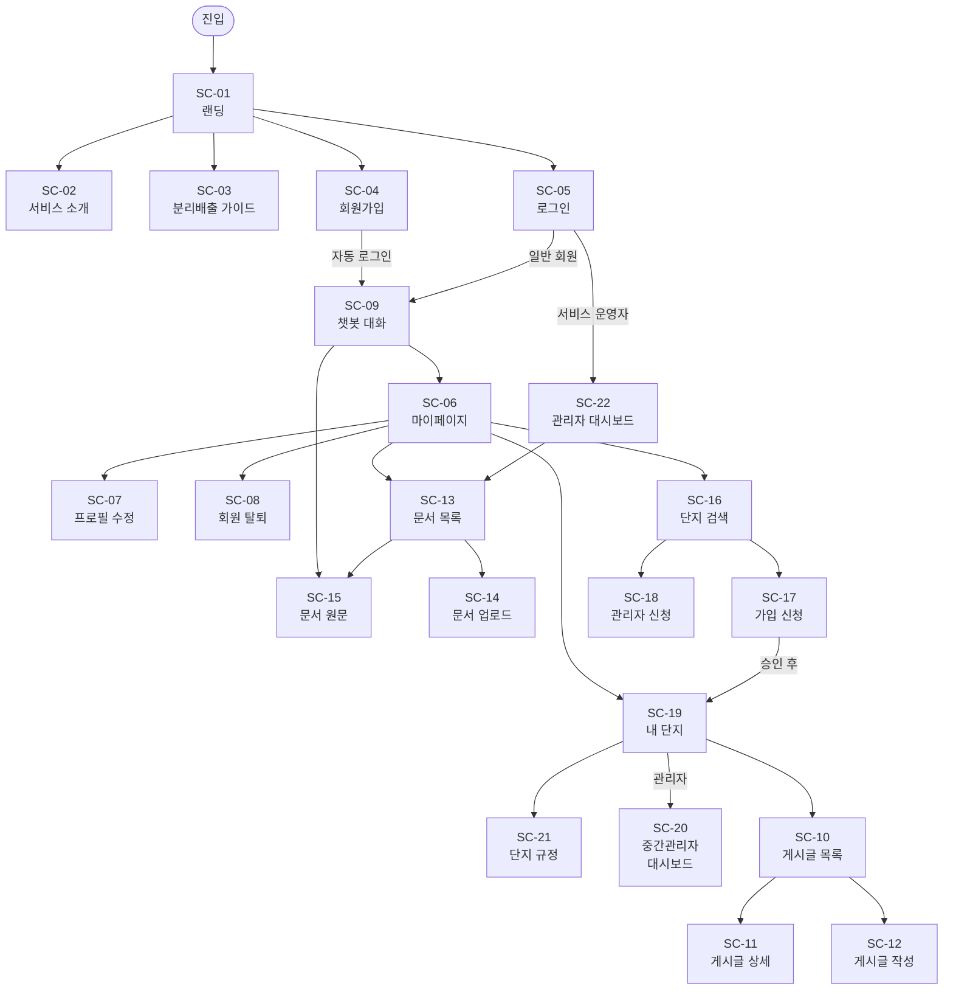
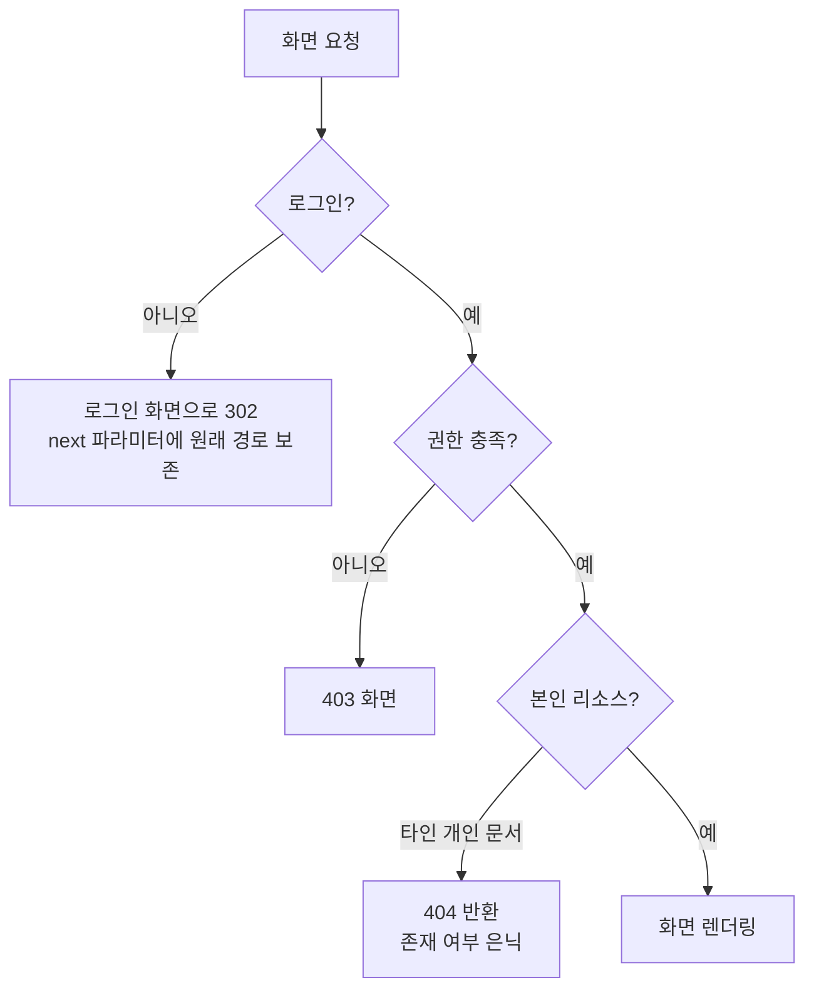
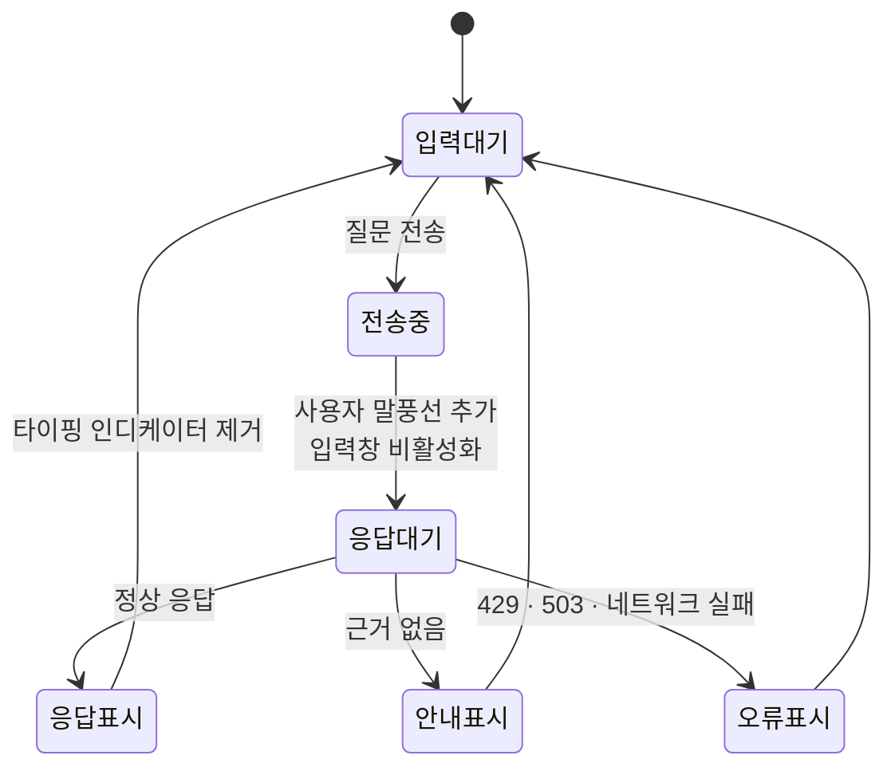

# EcoBot 화면설계서

**아파트 분리배출 AI 챗봇 서비스**
*UI/UX Functional Specification*

SKN32 4차 프로젝트 · 3팀

---

## 문서 버전 정보

| 버전 | 일자 | 변경 내용 |
|---|---|---|
| v1.0 | 2026-08-27 | 최초 작성. `deploy-ecobotapt` 브랜치 기준 |

---

## 목차

**0. 평가 기준 대응**

**1. 문서 개요**
　1.1 목적　1.2 설계 기준　1.3 화면 ID 체계

**2. 화면 인벤토리 — URL ↔ View ↔ Template 매핑**

**3. 화면 흐름도**

**4. 공통 레이아웃 및 디자인 시스템**
　4.1 템플릿 상속 구조　4.2 레이아웃 전략　4.3 공통 컴포넌트

**5. 인증 · 권한 흐름 설계**

**6. LLM 상호작용 UX 설계**
　6.1 상태 전이　6.2 응답 유형별 표현　6.3 오류 처리

**7. 화면별 상세 설계**

**8. 반응형 UI 설계**

**9. 화면 ↔ 요구사항 추적표**

**10. 미결 사항**

---

# 0. 평가 기준 대응

| 평가 요소 | 본 문서 반영 | 근거 |
|---|---|---|
| 반응형 UI 설계 (Flex/Grid) | §4.2, §8 | `display:flex` 118곳 · `display:grid` 12곳 · `gap` 89곳 실측. **미디어쿼리 0곳 — §10 미결 참고** |
| 화면-구조 매핑 정합성 (MVT) | §2 화면 인벤토리 | 8개 앱 `urls.py` ↔ `views.py` ↔ `templates` 1:1 대응, 화면 22종 |
| 인증 흐름 설계 | §5 | `LoginRequiredMixin` · `AdminRequiredMixin` · `CommunityAccessRequiredMixin` 등 5종 Mixin |
| LLM 상호작용 UX 설계 (비동기·로딩) | §6 | 입력 → 타이핑 인디케이터 → 응답/오류 상태 전이, 429·503 사유 표시 |

---

# 1. 문서 개요

## 1.1 목적

본 문서는 EcoBot 서비스의 화면 구성, 화면 간 이동, 접근 권한, 사용자 상호작용을 정의한다. 각 화면은 `요구사항_정의서.md`의 기능 요구사항(FR)과 §9에서 대응된다.

## 1.2 설계 기준

| 항목 | 내용 |
|---|---|
| 렌더링 방식 | Django MTV 서버 사이드 렌더링 + 부분 비동기(Fetch) |
| 비동기 적용 범위 | 대기가 긴 상호작용만 클라이언트 Fetch로 처리 (챗봇 질의응답, 관리자 통계 로딩) |
| 스타일 | 단일 CSS 파일(`static/css/style.css`, 2,307줄), 클래스 기반 |
| 스크립트 | Vanilla JS. 프레임워크 미사용 (`chat.js`, `dashboard.js`) |
| 언어 | 한국어 (`<html lang="ko">`) |

**3차 대비**: React SPA를 Django 템플릿으로 전환하되 **화면 구성과 시각적 디자인은 유지**했다. 3차 `style.css` 1,475줄을 그대로 계승하고 4차 신규 화면분을 더해 2,307줄이 되었다.

## 1.3 화면 ID 체계

`SC-NN` 형식이며, 도메인별로 묶어 부여한다.

| 대역 | 영역 |
|---|---|
| SC-01 ~ SC-03 | 공개 화면 (랜딩·서비스 소개·가이드) |
| SC-04 ~ SC-08 | 회원 |
| SC-09 | 챗봇 |
| SC-10 ~ SC-12 | 커뮤니티 |
| SC-13 ~ SC-15 | 문서·RAG |
| SC-16 ~ SC-21 | 아파트 단지 |
| SC-22 | 관리자 대시보드 |

---

# 2. 화면 인벤토리 — URL ↔ View ↔ Template 매핑

각 화면이 Django MVT 구조에 누락 없이 매핑됨을 보인다. View 유형은 CBV(클래스형)이며, 일부는 Django 제네릭 뷰를 상속한다.

## 2.1 공개 화면

| ID | 화면 | URL | View | Template | 접근 |
|---|---|---|---|---|---|
| SC-01 | 랜딩 | `/` | `HomeView` | `home.html` | 공개 |
| SC-02 | 서비스 소개 | `/service/` | `TemplateView` | `service.html` | 공개 |
| SC-03 | 분리배출 가이드 | `/guide/<key>/` | `GuideView` | `guide.html` | 공개 |

## 2.2 회원

| ID | 화면 | URL | View | Template | 접근 |
|---|---|---|---|---|---|
| SC-04 | 회원가입 | `/members/signup/` | `SignUpView` | `members/signup.html` | 공개 |
| SC-05 | 로그인 | `/members/login/` | `LoginView` | `members/login.html` | 공개 |
| SC-06 | 마이페이지 | `/members/mypage/` | `MyPageView` | `members/mypage.html` | 로그인 |
| SC-07 | 프로필 수정 | `/members/profile/edit/` | `ProfileUpdateView` | `members/profile_form.html` | 로그인 |
| SC-08 | 회원 탈퇴 | `/members/withdraw/` | `WithdrawView` | `members/withdraw.html` | 로그인 |

> 프로필 조회(`/members/profile/`, `profile.html`)는 마이페이지에 통합되어 단독 진입 경로가 없다.

## 2.3 챗봇

| ID | 화면 | URL | View | Template | 접근 |
|---|---|---|---|---|---|
| SC-09 | 챗봇 대화 | `/chat/` | `ChatRoomView` | `chat/room.html` | 로그인 |

챗봇 화면의 동작은 아래 AJAX 엔드포인트와 연동된다. 화면은 하나지만 상호작용은 6개 엔드포인트로 나뉜다.

| 엔드포인트 | View | 용도 |
|---|---|---|
| `POST /chat/ask/` | `ChatAskView` | 질문 전송·답변 수신 |
| `GET /chat/sessions/` | `ChatSessionListView` | 대화 목록 복원 |
| `POST /chat/sessions/<pk>/delete/` | `ChatSessionDeleteView` | 대화 삭제 |
| `GET /chat/popular/` | `PopularQuestionView` | 인기 질문 |
| `POST /chat/feedback/<pk>/` | `ChatFeedbackView` | 답변 피드백 |

## 2.4 커뮤니티

| ID | 화면 | URL | View | Template | 접근 |
|---|---|---|---|---|---|
| SC-10 | 게시글 목록 | `/boards/` | `BoardListView` (ListView) | `boards/board_list.html` | 단지 소속 |
| SC-11 | 게시글 상세 | `/boards/<pk>/` | `BoardDetailView` (DetailView) | `boards/board_detail.html` | 단지 소속 |
| SC-12 | 게시글 작성·수정 | `/boards/create/`, `/<pk>/update/` | `BoardCreateView`, `BoardUpdateView` | `boards/board_form.html` | 단지 소속 / 작성자 |

## 2.5 문서 · RAG

| ID | 화면 | URL | View | Template | 접근 |
|---|---|---|---|---|---|
| SC-13 | 문서 목록 | `/rag/documents/` | `DocumentListView` | `rag/document_list.html` | 로그인 |
| SC-14 | 문서 업로드 | `/rag/documents/upload/` | `DocumentUploadView` | `rag/document_upload.html` | 로그인 |
| SC-15 | 문서 원문 | `/rag/documents/<pk>/` | `DocumentDetailView` | `rag/document_detail.html` | 로그인 · 소유자 |

## 2.6 아파트 단지

| ID | 화면 | URL | View | Template | 접근 |
|---|---|---|---|---|---|
| SC-16 | 단지 검색 | `/apartments/search/` | `ApartmentSearchView` | `apartments/apartment_search.html` | 로그인 |
| SC-17 | 단지 가입 신청 | `/apartments/join/` | `ApartmentJoinView` | `apartments/join.html` | 로그인 |
| SC-18 | 관리자 신청 | `/apartments/manager/apply/` | `ManagerApplyView` | `apartments/manager_apply.html` | 로그인 |
| SC-19 | 내 단지 | `/apartments/mine/` | `MyApartmentView` | `apartments/my_apartment.html` | 로그인 |
| SC-20 | 중간관리자 대시보드 | `/apartments/manager-dashboard/` | `ManagerDashboardView` | `apartments/manager_dashboard.html` | 단지 관리자 |
| SC-21 | 단지 규정 목록·등록 | `/apartments/rules/`, `/rules/new/` | `ApartmentRuleListView`, `ApartmentRuleCreateView` | `apartments/rule_list.html`, `rule_form.html` | 로그인 / 관리자 |

**보조 화면** (독립 진입 경로 없이 SC-19·SC-20에서 연결)

| 화면 | URL | Template | 접근 |
|---|---|---|---|
| 입주민 승인 큐 | `/apartments/membership/residents/` | `resident_queue.html` | 단지 관리자 |
| 단지 관리자 승인 큐 | `/apartments/membership/queue/` | `membership_queue.html` | 서비스 운영자 |
| 입주민 명부 | `/apartments/membership/residents/roster/` | `resident_roster.html` | 단지 관리자 |
| 관리자 명부 | `/apartments/membership/managers/roster/` | `manager_roster.html` | 서비스 운영자 |

## 2.7 관리자

| ID | 화면 | URL | View | Template | 접근 |
|---|---|---|---|---|---|
| SC-22 | 관리자 대시보드 | `/dashboard/` | `DashboardView` | `dashboard/index.html` | 서비스 운영자 |

대시보드는 단일 화면 안에서 탭 전환되며, 각 탭이 별도 API를 호출한다.

| 탭 | 엔드포인트 | 표현 |
|---|---|---|
| 질문 통계 | `stats`, `top-questions`, `region-stats`, `daily-trend` | 요약 카드 + 차트 + 목록 |
| 문서 관리 | `documents`, `rag:rebuild`, `rag:search` | 목록 + 업로드 + 재색인 |
| 만족도 | `feedback-stats` | 집계 + 부정 피드백 목록 |

## 2.8 매핑 요약

| 항목 | 수량 |
|---|---|
| 정의된 화면 (SC) | 22 |
| 보조 화면 | 4 |
| 템플릿 파일 | 30 (`base.html`, `_nav.html` 포함) |
| 화면 라우트 | 26 |
| AJAX 엔드포인트 | 20 |

---

# 3. 화면 흐름도



**진입 분기**: 로그인 성공 시 서비스 운영자는 관리자 대시보드로, 일반 회원은 챗봇으로 이동한다. 회원가입 성공 시에는 자동 로그인 후 챗봇으로 직행한다(FR-101).

---

# 4. 공통 레이아웃 및 디자인 시스템

## 4.1 템플릿 상속 구조

```
base.html  (13줄 — 최소 골격)
├── <head>: charset · viewport · title 블록 · style.css
├──      ← 각 화면이 채움
└──      ← 페이지별 스크립트
```

`base.html`은 문서 골격과 스타일시트 연결만 담당하는 **최소 구조**이다. 헤더·네비게이션·푸터는 공통 블록으로 추출되어 있지 않고 각 화면이 직접 구성한다.

`_nav.html` (apartments 앱)만 `` 방식의 부분 템플릿으로 존재하며, 단지 관련 화면에서 공유된다.

**전체 30개 템플릿 중 28개가 `base.html`을 상속**한다. 나머지 둘은 `base.html` 자신과 `_nav.html`(include 전용)이다.

## 4.2 레이아웃 전략

Flexbox를 주 레이아웃 수단으로, Grid를 카드·통계 배치에 사용한다.

| 기법 | 사용 횟수 | 주 용도 |
|---|---|---|
| `display: flex` | 118 | 헤더 정렬, 버튼 그룹, 메시지 행, 폼 필드 |
| `display: grid` | 12 | 랜딩 특징 카드, 지역 목록, 통계 카드 |
| `grid-template-columns` | 12 | 고정 열 배치 |
| `gap` | 89 | 요소 간 간격 (마진 대신 사용) |

`gap`을 89곳에서 사용하여 마진 상쇄 문제를 회피하고 간격 규칙을 일관되게 유지했다.

## 4.3 공통 컴포넌트

| 컴포넌트 | 적용 화면 | 설명 |
|---|---|---|
| 상단 헤더 | 전 화면 | 로고 + 주요 이동 링크 + 로그인 상태 표시 |
| 폼 필드 | SC-04, 05, 07, 12, 14, 17, 18, 21 | 라벨 + 입력 + 오류 메시지(`form-error`) |
| 플래시 메시지 | 전 화면 | Django `messages` 프레임워크 연동 |
| 카드 | SC-01, 06, 19, 22 | 정보 묶음 표현 |
| 목록 + 페이지네이션 | SC-10, 13 | 10건 단위 |
| 모달 | SC-06, 22 | 확인 대화상자, 업로드 |
| 탭 | SC-06, 22 | 마이페이지·대시보드 영역 전환 |

---

# 5. 인증 · 권한 흐름 설계

## 5.1 접근 제어 Mixin

화면 접근 제어는 5종 Mixin으로 판정한다. 뷰마다 개별 검사 코드를 두지 않는다.

| Mixin | 판정 | 미충족 시 |
|---|---|---|
| `LoginRequiredMixin` | 로그인 여부 | 로그인 화면으로 302 |
| `AdminRequiredMixin` | `is_staff` | 403 |
| `CommunityAccessRequiredMixin` | 승인된 단지 소속 | 403 |
| `BoardObjectAccessMixin` | 게시글 열람 권한 | 403 / 404 |
| `BoardAuthorRequiredMixin` | 작성자 본인 | 403 |
| `BoardDeletePermissionMixin` | 작성자 또는 단지 관리자 | 403 |

## 5.2 화면별 접근 권한 매트릭스

| 화면 | 비로그인 | 일반 회원 | 입주민 | 단지 관리자 | 서비스 운영자 |
|---|:--:|:--:|:--:|:--:|:--:|
| SC-01 랜딩 | ○ | ○ | ○ | ○ | ○ |
| SC-02 서비스 소개 | ○ | ○ | ○ | ○ | ○ |
| SC-03 가이드 | ○ | ○ | ○ | ○ | ○ |
| SC-04 회원가입 | ○ | — | — | — | — |
| SC-05 로그인 | ○ | — | — | — | — |
| SC-06 마이페이지 | ✕ | ○ | ○ | ○ | ○ |
| SC-07 프로필 수정 | ✕ | ○ | ○ | ○ | ○ |
| SC-08 회원 탈퇴 | ✕ | ○ | ○ | ○ | ○ |
| SC-09 챗봇 | ✕ | ○ | ○ | ○ | ○ |
| SC-10 게시글 목록 | ✕ | △ | ○ | ○ | ○ |
| SC-11 게시글 상세 | ✕ | △ | ○ | ○ | ○ |
| SC-12 게시글 작성 | ✕ | ✕ | ○ | ○ | ○ |
| SC-13 문서 목록 | ✕ | ○ | ○ | ○ | ○ |
| SC-14 문서 업로드 | ✕ | ○ | ○ | ○ | ○ |
| SC-15 문서 원문 | ✕ | ◐ | ◐ | ◐ | ○ |
| SC-16 단지 검색 | ✕ | ○ | ○ | ○ | ○ |
| SC-17 가입 신청 | ✕ | ○ | ○ | ○ | ○ |
| SC-18 관리자 신청 | ✕ | ○ | ○ | ○ | ○ |
| SC-19 내 단지 | ✕ | ○ | ○ | ○ | ○ |
| SC-20 중간관리자 대시보드 | ✕ | ✕ | ✕ | ○ | ○ |
| SC-21 단지 규정 | ✕ | ✕ | ○ | ○(등록) | ○ |
| SC-22 관리자 대시보드 | ✕ | ✕ | ✕ | ✕ | ○ |

> ○ 전체 허용　△ 공지 분류만 열람　◐ 본인 문서 및 공용 문서만　✕ 차단

## 5.3 미인가 접근 시 화면 처리



**타인의 개인 문서는 403이 아니라 404를 반환한다.** 403을 주면 "그 문서가 존재한다"는 사실이 드러나기 때문이다(NFR-210).

---

# 6. LLM 상호작용 UX 설계

챗봇 질의응답은 임베딩 호출과 답변 생성으로 수 초에서 수십 초가 걸린다. 이 대기 시간을 사용자가 "멈췄다"고 느끼지 않도록 상태를 명시적으로 표현한다.

## 6.1 상태 전이



**응답대기 상태의 표현**: 봇 말풍선 자리에 점 3개가 순차적으로 깜빡이는 타이핑 인디케이터(`#typing-indicator`)를 삽입한다. 응답이 도착하거나 실패하면 이 요소를 제거하고 실제 내용으로 교체한다. 중복 전송을 막기 위해 `isTyping` 플래그로 입력을 잠근다.

## 6.2 응답 유형별 표현

서버 응답에 따라 봇 말풍선의 구성이 달라진다.

| 유형 | 표시 요소 | 대응 요구사항 |
|---|---|---|
| **정상 답변** | 본문 + 실천 팁 + 출처 카드(문서명·발췌·원문 링크) | FR-201, FR-202 |
| **근거 없음** | 안내 문구 + 관리사무소·지자체 연락처 카드 + 유사 질문 추천 버튼 | FR-203, FR-211, FR-212 |
| **시행 예정 법령 포함** | 정상 답변 + 하단에 "곧 이렇게 바뀝니다" 예고 배너 | FR-210 |
| **한도 초과** | 한도 초과 안내 + 초기화 시각 | FR-215 |

**유사 질문 추천은 클릭 가능한 버튼으로 렌더링**되어, 사용자가 다시 타이핑하지 않고 바로 재질의할 수 있다.

각 봇 답변에는 만족도 버튼이 붙으며, 클릭 시 비동기로 전송되고 버튼 상태만 갱신된다(화면 새로고침 없음).

## 6.3 오류 처리

서버가 본문에 사유를 담아 보내는 경우 그 문구를 그대로 보여준다.

| 상태 | 화면 표시 |
|---|---|
| 429 (하루 한도 초과) | 서버가 보낸 안내 문구 + 초기화 시각 |
| 503 (검색·LLM API 장애) | 서버가 보낸 장애 안내 |
| 네트워크 실패 | "답변을 가져오지 못했습니다. 잠시 후 다시 시도해 주세요." |

> **개선 이력**: 이전에는 응답 코드가 정상이 아니면 곧바로 예외로 던져 서버가 보낸 사유를 버리고 일반 안내만 표시했다. 사용자는 왜 막혔는지 알 수 없었다. 현재는 본문을 먼저 파싱해 `detail`·`answer` 필드를 확인한 뒤, 사유가 있으면 그것을 우선 표시한다. 네트워크 끊김처럼 응답 자체가 없던 경우에만 일반 안내로 대체하며, 사유가 이미 표시된 경우 중복 메시지를 쌓지 않는다.

## 6.4 대화 관리 UX

| 동작 | 처리 |
|---|---|
| 새 대화 | 클라이언트가 빈 대화 상태만 만들고 서버 호출은 하지 않는다. 첫 질문에서 서버가 대화방을 생성하므로 빈 대화방 행이 쌓이지 않는다. |
| 대화 전환 | 사이드바 목록에서 선택하면 저장된 메시지를 다시 렌더링한다. |
| 대화 삭제 | 서버에서 실제 삭제한다. (3차는 화면에서만 지워져 새로고침하면 되살아났다.) |
| 지역 선택 | 대화방별로 지역이 기억되어 새로고침 시 기본값으로 초기화되지 않는다. |
| 사이드바 크기 | 드래그 핸들(`#sidebar-resize-handle`)로 너비 조절 가능 |

## 6.5 XSS 방어

봇 답변과 출처 발췌는 서버가 생성한 텍스트이지만, 사용자 질문이 그대로 되돌아오는 경로가 있다. 모든 말풍선 렌더링에 `escapeHtml()`을 적용한다(3차 미적용분 수정, NFR-207).

---

# 7. 화면별 상세 설계

## SC-01 랜딩 (`home.html`, 234줄)

**목적**: 비로그인 방문자에게 서비스를 소개하고 가입·로그인으로 유도한다.

| 영역 | 구성 |
|---|---|
| 헤더 | 로고, 로그인·회원가입 버튼 |
| 히어로 | 서비스 소개 문구, 시작하기·서비스 안내 CTA |
| 고지 | "법적 효력이 있는 공식 답변이 아님" 안내 |
| 기능 카드 (Grid 3열) | 분리배출 안내 · 음식물쓰레기 · 에너지 절약 |
| 커뮤니티 배너 | 로그인 유도 |
| 지원 지역 (Grid) | 10개 지역 링크 → SC-03 가이드 |
| 서비스 특징 | 5개 항목 |
| 푸터 | 저작권, 이용약관·개인정보처리방침·문의하기 |

**미결**: 푸터의 이용약관·개인정보처리방침·문의하기 링크가 `#`로 비어 있다(§10).

## SC-04 회원가입 (`signup.html`, 186줄)

**입력 항목**: 아이디, 비밀번호, 비밀번호 확인, 닉네임, 거주 지역

**검증 및 오류 표현**: Django Form 검증 결과를 필드 하단에 `form-error` 클래스로 표시한다. 아이디 중복, 비밀번호 불일치, 비밀번호 정책 위반이 여기에 해당한다.

**성공 흐름**: 가입 완료 → 자동 로그인 → 챗봇 화면(SC-09)으로 이동. 별도 로그인 절차를 요구하지 않는다.

**거주 지역**은 이후 챗봇 답변의 기본 지역 필터로 사용되므로 필수 입력이다.

## SC-09 챗봇 대화 (`chat/room.html`, 100줄) ★ 핵심 화면

**레이아웃**: 좌측 사이드바 + 우측 대화 영역의 2단 구성(Flex).

| 영역 | 요소 ID | 구성 |
|---|---|---|
| 사이드바 | `#sidebar` | 새 대화 버튼(`#new-chat-btn`), 대화 목록(`#chat-list`), 크기 조절 핸들 |
| 상단 | `#chat-title` | 현재 대화 제목, 지역 선택(`#region-select`) |
| 대화 영역 | `#chat-messages` | 사용자·봇 말풍선, 타이핑 인디케이터 |
| 입력 | `#chat-input`, `#send-btn` | 텍스트 입력, 전송 버튼 |

**설정 전달**: 템플릿이 `#chat-config` 요소에 URL·지역 목록 등을 JSON으로 심고, `chat.js`가 이를 읽는다. 하드코딩된 URL이 스크립트에 남지 않는다.

**첫 진입 시**: 인기 질문이 표시되어 클릭만으로 질의할 수 있다.

상세 상호작용은 §6 참고.

## SC-10 게시글 목록 (`board_list.html`, 140줄)

**필터**: 지역, 분류(카테고리). 쿼리 파라미터로 전달된다.
**페이지네이션**: 10건 단위.
**표시 항목**: 제목, 작성자, 분류, 조회수, 좋아요 수, 댓글 수, 작성일.
**비공개 처리된 글**은 목록에서 제외된다.

**접근 분기**: 승인된 단지 소속이 없고 신청 상태만 있는 사용자에게는 공지 분류만 노출된다(FR-508).

## SC-11 게시글 상세 (`board_detail.html`, 169줄)

**구성**: 본문 + 첨부파일 + 좋아요 버튼 + 댓글 목록 + 댓글 작성 폼.
**조회수**: 진입 시 1 증가한다.
**권한별 버튼**: 작성자에게는 수정·삭제, 단지 관리자에게는 비공개 처리 버튼이 노출된다.

## SC-14 문서 업로드 (`document_upload.html`, 98줄)

**입력 항목**: 파일 또는 직접 입력 본문, 제목, 지역.
**검증**: 허용되지 않은 확장자는 400으로 거부하고 레코드를 만들지 않는다.
**응답 특성**: 업로드 요청은 재색인을 기다리지 않고 **즉시** 완료된다. 화면에는 "색인 반영까지 최대 5분" 취지의 안내가 필요하다(§10 미결).

## SC-20 중간관리자 대시보드 (`manager_dashboard.html`, 171줄)

단지 관리자 전용 화면으로, 단지 운영에 필요한 항목을 한 화면에 모은다.

| 영역 | 내용 |
|---|---|
| 단지 정보 | 이름, 주소, 관리사무소 연락처·운영시간 (수정 가능) |
| 입주민 승인 | 대기 중인 가입 신청 목록 → 승인·거절 |
| 입주민 명부 | 승인된 입주민 목록 |
| 단지 규정 | 분류별 규정 목록 (등록일 포함) → 등록·삭제 |

## SC-22 관리자 대시보드 (`dashboard/index.html`, 268줄)

3탭 구성이며, 탭 전환 시 해당 API만 호출한다.

| 탭 | 구성 |
|---|---|
| 질문 통계 | 요약 카드 5종(전체·오늘·어제·활성 사용자·성공률) + 일자별 추이 차트 + 지역별 집계 + 인기 질문 TOP |
| 문서 관리 | 색인 문서 목록(청크 수 포함) + 업로드 + 삭제 + 재색인 + 진단 검색 |
| 만족도 | 피드백 집계 + 최근 부정 피드백 목록 |

`dashboard.js`가 각 영역을 비동기로 로딩하므로, 한 API가 느려도 다른 영역이 먼저 표시된다.

## SC-06 마이페이지 (`mypage.html`, 252줄)

탭 방식으로 프로필·소속 단지·내 문서·내 게시글을 통합한다. 역할에 따라 노출 항목이 달라진다.

| 역할 | 추가 노출 |
|---|---|
| 입주민 | 소속 단지 정보, 내 게시글 |
| 단지 관리자 | 중간관리자 대시보드 진입 링크 |
| 서비스 운영자 | 관리자 대시보드 진입 링크 |

---

# 8. 반응형 UI 설계

## 8.1 현재 적용된 기법

| 기법 | 상태 | 근거 |
|---|---|---|
| 뷰포트 메타 태그 | ✅ 적용 | `base.html`에 `width=device-width, initial-scale=1.0` |
| Flexbox 레이아웃 | ✅ 118곳 | 헤더·버튼 그룹·폼·메시지 행 |
| Grid 레이아웃 | ✅ 12곳 | 카드 배치, 지역 목록, 통계 카드 |
| `gap` 간격 규칙 | ✅ 89곳 | 마진 상쇄 없는 일관된 간격 |
| **미디어 쿼리** | 🔴 **0곳** | 아래 참고 |
| `minmax()` 자동 열 조정 | 🔴 미사용 | |
| `clamp()` 유동 타이포그래피 | 🔴 미사용 | |

## 8.2 미디어 쿼리 부재에 대한 분석

`style.css` 2,307줄 전체와 모든 템플릿을 검사한 결과 **`@media` 규칙이 하나도 없다.**

Flexbox와 Grid는 컨테이너 폭이 줄면 요소가 눌리거나 넘치며, 자동으로 열 수를 줄이지 않는다. `grid-template-columns`가 12곳 모두 고정 열로 선언되어 있어, 좁은 화면에서는 가로 스크롤이 발생하거나 카드가 과도하게 압축될 가능성이 높다.

**영향이 큰 화면**

| 화면 | 예상 문제 |
|---|---|
| SC-09 챗봇 | 사이드바 + 대화 영역 2단 구성. 모바일 폭에서 대화 영역이 크게 좁아짐 |
| SC-22 관리자 대시보드 | 통계 카드 다열 배치, 차트 |
| SC-01 랜딩 | 기능 카드 3열, 지역 목록 다열 |
| SC-10 게시글 목록 | 다열 테이블형 목록 |

## 8.3 개선 방안

평가 요소에 "반응형 UI 설계 (Flex/Grid)"가 포함되어 있으므로, 제출 전 최소한의 대응이 필요하다. 작업량이 적은 순서로 정리한다.

**1단계 — 자동 열 조정 (미디어 쿼리 없이 즉시 효과)**

고정 열 선언을 `auto-fit` + `minmax()`로 바꾸면 폭에 따라 열 수가 자동 조정된다.

```css
/* 변경 전 */
grid-template-columns: 1fr 1fr 1fr;

/* 변경 후 — 최소 260px를 확보하지 못하면 열 수가 줄어듦 */
grid-template-columns: repeat(auto-fit, minmax(260px, 1fr));
```

12곳의 `grid-template-columns` 중 카드형 배치에 이 패턴을 적용하면 랜딩·대시보드·마이페이지가 함께 개선된다.

**2단계 — 주요 브레이크포인트 3개 도입**

| 브레이크포인트 | 대응 |
|---|---|
| `max-width: 1024px` | 대시보드 통계 카드 2열로 축소 |
| `max-width: 768px` | 챗봇 사이드바를 상단 접이식으로 전환, 다열 목록을 1열로 |
| `max-width: 480px` | 폰트·여백 축소, 버튼 전폭 전환 |

**3단계 — 유동 타이포그래피**

```css
font-size: clamp(1.5rem, 4vw, 2.5rem);
```

랜딩 히어로 문구 등 큰 텍스트에 적용하면 브레이크포인트 없이도 화면 폭에 비례해 조정된다.

## 8.4 접근성 현황

| 항목 | 상태 |
|---|---|
| 언어 선언 | ✅ `<html lang="ko">` |
| 폼 라벨 연결 | 부분 적용 — 화면별 확인 필요 |
| 시맨틱 태그 | 부분 적용 |
| `aria-*` 속성 | 미적용 |
| 키보드 탐색 | 표준 폼 요소 기본 동작에 의존 |

---

# 9. 화면 ↔ 요구사항 추적표

| 화면 ID | 화면 | 대응 요구사항 | 테스트 |
|---|---|---|---|
| SC-01 | 랜딩 | — | TC-106 |
| SC-02 | 서비스 소개 | — | TC-106 |
| SC-03 | 분리배출 가이드 | FR-108 | TC-106 |
| SC-04 | 회원가입 | FR-101 | TC-101 |
| SC-05 | 로그인 | FR-102, FR-705 | TC-102, TC-705 |
| SC-06 | 마이페이지 | FR-104, FR-106 | TC-104 |
| SC-07 | 프로필 수정 | FR-105 | TC-104 |
| SC-08 | 회원 탈퇴 | FR-107 | TC-105 |
| SC-09 | 챗봇 대화 | FR-201~216, FR-709 | TC-201~216 |
| SC-10 | 게시글 목록 | FR-501, FR-508 | TC-501, TC-504 |
| SC-11 | 게시글 상세 | FR-503, FR-505~507 | TC-501~503 |
| SC-12 | 게시글 작성·수정 | FR-502, FR-504 | TC-501 |
| SC-13 | 문서 목록 | FR-301, FR-304 | TC-301, TC-304 |
| SC-14 | 문서 업로드 | FR-302, FR-305 | TC-302, TC-305 |
| SC-15 | 문서 원문 | FR-303 | TC-303 |
| SC-16 | 단지 검색 | FR-401 | TC-401 |
| SC-17 | 단지 가입 신청 | FR-402 | TC-401 |
| SC-18 | 관리자 신청 | FR-403 | TC-401 |
| SC-19 | 내 단지 | FR-404, FR-405, FR-408 | TC-401, TC-402 |
| SC-20 | 중간관리자 대시보드 | FR-406, FR-409, FR-411 | TC-402, TC-403 |
| SC-21 | 단지 규정 | FR-412~415 | TC-404, TC-405 |
| SC-22 | 관리자 대시보드 | FR-601~608 | TC-601, TC-602 |
| 전 화면 | 인증 흐름 | FR-608, NFR-202, NFR-203 | TC-602 |
| 전 화면 | 정적 파일 서빙 | FR-804 | TC-802 |

---

# 10. 미결 사항

| 항목 | 내용 | 우선순위 |
|---|---|---|
| 🔴 미디어 쿼리 부재 | `@media` 0곳. 모바일·태블릿 폭에서 레이아웃 붕괴 가능. 평가 요소에 해당 (§8.3 개선 방안 참고) | 상 |
| 🟡 푸터 링크 미연결 | 이용약관·개인정보처리방침·문의하기가 `#`로 비어 있음. 개인정보를 수집하는 서비스이므로 최소한 처리방침은 필요 | 중 |
| 🟡 재색인 지연 안내 부재 | SC-14 업로드 완료 후 "색인 반영까지 최대 5분" 안내가 없어, 사용자가 즉시 검색되지 않는 것을 오류로 오인할 수 있음 | 중 |
| 🟡 `base.html` 최소 구조 | 헤더·푸터가 공통 블록으로 추출되어 있지 않아 화면마다 중복 정의. 수정 시 누락 위험 | 하 |
| 🟡 프로필 조회 화면 고립 | `profile.html`이 존재하나 마이페이지 통합으로 진입 경로 없음. 통합 또는 제거 판단 필요 | 하 |
| 🟡 접근성 속성 미적용 | `aria-*` 속성 및 시맨틱 태그 부분 적용 | 하 |
